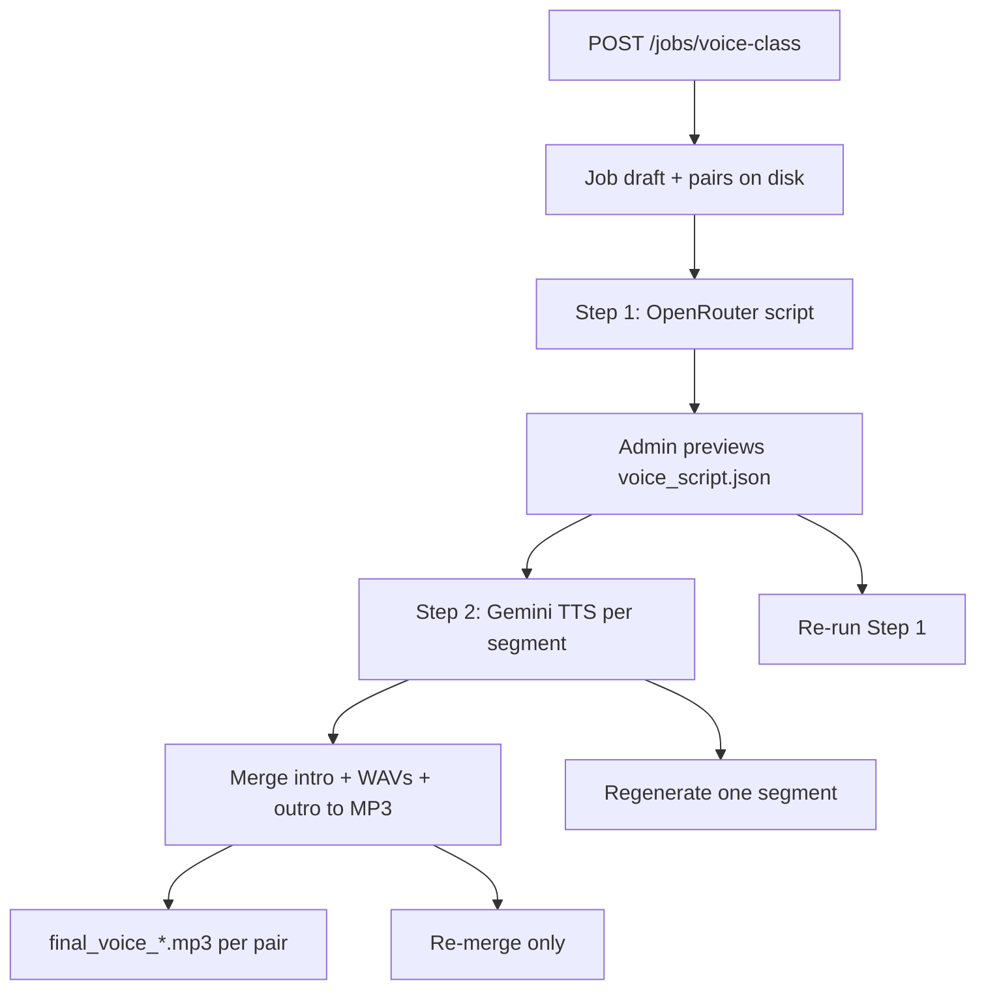

# AI Voice / Speech Class Job

## Goal

New job type **`voice_class`** in the web app:

1. **Step 1 (Script)** — Admin uploads **Importance & Type JSON** (`a*.json`) + **Word doc** with سوالات شناسنامه‌دار; OpenRouter generates a structured script JSON (one paragraph per row) for admin review.
2. **Step 2 (Voice)** — After review, Gemini TTS generates ≤1-minute audio chunks per segment, rotates through the **admin-managed Gemini TTS key pool** (DB) on quota errors, then merges **intro + segments + outro** into **one MP3 per chapter pair**.

Existing assets to reuse:
- Intro/outro: [`content_automation_project/songs/a_int.mp3`](content_automation_project/songs/a_int.mp3), [`a_out.mp3`](content_automation_project/songs/a_out.mp3)
- TTS implementation: [`api_layer.py`](content_automation_project/api_layer.py) (`GeminiAPIClient.generate_tts_async`) — same pattern as [`automation_text2voice/script_tts.py`](../automation_text2voice/script_tts.py)
- Audio merge: [`automation_text2voice/audio_concatenator.py`](../automation_text2voice/audio_concatenator.py) (pydub + ffmpeg)
- Word reading: [`word_file_processor.py`](content_automation_project/word_file_processor.py)
- Two-step UI pattern: legacy `test_bank` in [`job_detail.html`](content_automation_project/webapp/templates/job_detail.html) + [`tasks_stage_v.py`](content_automation_project/webapp/tasks_stage_v.py)



---

## Job inputs (per pair)

| Input | Source | Pairing |
|-------|--------|---------|
| Tagged lesson JSON | Importance & Type output `a{book}{chapter}.json` | By book/chapter from `PointId` / filename (same as [`auto_pair_chapter_summary_files`](content_automation_project/stage_v_pairing.py)) |
| Questions Word doc | `.docx` with شناسنامه questions | Matched to same book/chapter via existing Stage V pairing helper [`auto_pair_stage_v_files`](content_automation_project/stage_v_pairing.py) |

Creation form: [`webapp/templates/voice_class_new.html`](content_automation_project/webapp/templates/voice_class_new.html) (mirror [`chapter_summary_new.html`](content_automation_project/webapp/templates/chapter_summary_new.html)).

Config stored in `Job.config_json`:
- `display_name`, `prompt_1`, `provider_1`, `model_1` (OpenRouter, Step 1 — script JSON)
- `tts_model`, `tts_voice`, `tts_instruction` (Gemini TTS performance/style — default from `promptforspeech.txt`)
- `max_segment_seconds` (default `60`)
- `chars_per_second` (default `13` for Persian estimate)
- `delay_seconds`

Gemini TTS keys are **not** per-job — they live in the shared DB pool (see Admin API Keys section below).

**Do not** add `voice_class` to `SINGLE_STAGE_JOB_TYPES` in [`job_runner_common.py`](content_automation_project/webapp/job_runner_common.py) so the existing Step 1 / Step 2 cards appear.

---

## Step 1 — Script generation (OpenRouter)

**New module:** [`stage_voice_processor.py`](content_automation_project/stage_voice_processor.py)

For each pair:
1. Load `a*.json` records (Imp/Type/topics) via `BaseStageProcessor`.
2. Read Word doc via `WordFileProcessor.read_word_file` + `prepare_word_for_model`.
3. Call OpenRouter through existing [`UnifiedAPIClient.process_text`](content_automation_project/unified_api_client.py) with a new prompt key **`Voice Class Script Prompt`** in [`prompts.json`](content_automation_project/prompts.json).

**LLM output → validated JSON** (saved as `voice_script_{book}{chapter}.json` under `pair_N/output/`):

```json
{
  "metadata": {
    "book_id": 105,
    "chapter_id": 30,
    "chapter_name": "...",
    "source_tagged_json": "...",
    "source_word_doc": "..."
  },
  "paragraphs": [
    {
      "paragraph_id": 1,
      "chapter": "...",
      "subchapter": "...",
      "topic": "...",
      "text": "...",
      "char_count": 420,
      "estimated_seconds": 32.3
    }
  ],
  "segments": [
    {
      "segment_id": 1,
      "paragraph_ids": [1, 2, 3],
      "paragraph_count": 3,
      "combined_text": "...",
      "char_count": 780,
      "estimated_seconds": 58.5
    }
  ]
}
```

**Segment packing (≤1 minute):**
- After LLM returns paragraphs, run deterministic bin-packing in Python (not LLM): greedily group consecutive paragraphs while `estimated_seconds ≤ max_segment_seconds`.
- `estimated_seconds = char_count / chars_per_second` (conservative default ~13 chars/sec for Persian).
- Also cap each segment at **4096 chars** (TTS context limit used in [`automation_text2voice/tts_input_editor.py`](../automation_text2voice/tts_input_editor.py)).
- Script JSON exposes `paragraph_count` per segment and total segment count so admin knows how many TTS calls Step 2 will make.

**Runner:** [`webapp/tasks_voice_class.py`](content_automation_project/webapp/tasks_voice_class.py) — `run_voice_class_step1_job()` wired from [`run_step1_job`](content_automation_project/webapp/tasks_stage_v.py) when `job.type == "voice_class"`.

Register artifacts with role **`voice_script_json`** and **`llm_prompt_step1`**.

---

## Step 2 — TTS + merge

**Gemini key rotation — new:** [`webapp/gemini_tts_key_manager.py`](content_automation_project/webapp/gemini_tts_key_manager.py)

- Load **active** keys from DB table `gemini_tts_api_keys` (ordered round-robin).
- On 429/quota/rate-limit errors: mark key `exhausted_until` (e.g. +1 hour), try next key; fail pair only when all active keys exhausted.
- Use dedicated `GeminiAPIClient` from [`api_layer.py`](content_automation_project/api_layer.py) (not `UnifiedAPIClient`, which disables TTS).
- Pass **`tts_instruction`** from job config (default = content of `promptforspeech.txt`) as the `instruction` argument to `generate_tts_async` — this controls delivery style (engaging Farsi lecturer persona), separate from the spoken script text.

For each segment in script JSON:
1. Generate `segment_{id:03d}.wav` (24 kHz mono, same as existing TTS).
2. Optionally measure actual duration with pydub; log if estimate was off (no re-pack in v1 unless admin re-runs Step 1).
3. Register artifact role **`tts_segment`**.

**Merge** (new helper in `stage_voice_processor.py` or `webapp/audio_merge.py`):
- `songs/a_int.mp3` + all segment WAVs (ordered by `segment_id`) + `songs/a_out.mp3`
- Normalize to 44.1 kHz stereo (same as audio_concatenator)
- Export `final_voice_{book}{chapter}.mp3` (64 kbps)
- Register artifact role **`final_mp3`**

**Runner:** `run_voice_class_step2_job()` dispatched from [`run_step2_job`](content_automation_project/webapp/tasks_stage_v.py) when `job.type == "voice_class"` (today Step 2 only runs Stage V Test Bank — add early branch for voice class).

---

## Admin Gemini TTS API Keys page

**Recommendation: database, not JSON file.**

| Approach | Pros | Cons |
|----------|------|------|
| **Database (chosen)** | Admin UI with names; enable/disable keys; track quota exhaustion; bulk CSV import; no secrets in job config or git | Needs one new table + migration |
| JSON file on disk | Simple read at runtime | Hard to manage via UI; file permissions; stale keys; no per-key status |

### New model — `GeminiTtsApiKey` in [`webapp/models.py`](content_automation_project/webapp/models.py)

| Column | Purpose |
|--------|---------|
| `id` | PK |
| `account_name` | Display name (from CSV `account` or filename) |
| `project_name` | Optional project label |
| `api_key` | Secret (never shown in UI after save — mask as `AIza…xxxx`) |
| `is_active` | Admin can disable without deleting |
| `exhausted_until` | Nullable; set on 429/quota, cleared after cooldown |
| `last_error` | Short sanitized error for admin debugging |
| `last_used_at` | Rotation / monitoring |
| `created_at`, `updated_by_id` | Audit |

### Admin page — `GET/POST /admin/gemini-tts-keys`

Admin-only (same guard as [`/admin/prompt-defaults`](content_automation_project/webapp/main.py)):
- **List** all keys: account name, project, masked key, active status, exhausted until, last used
- **Add** single key manually (account name + project + key)
- **Bulk import CSV** — accepts existing format from your Downloads folder:

```csv
row;account;project;api_key
1;bagher;my project 3;AIzaSy...
```

Also accept comma delimiter. Skip duplicate keys (by hash prefix). If `account` is empty (e.g. `naghshyarco 3freetier.csv`), derive name from uploaded filename.

- **Toggle active** / **Delete** per row
- Link in admin nav / base template (next to prompt defaults if present)

### Seed on first startup

Import your existing 5 CSV files from `/Users/mehrad/Downloads/apikeys/` into DB if table is empty:

| File | Keys | Account names |
|------|------|---------------|
| `bagher apikey.csv` | 3 | bagher |
| `navid apikey.csv` | 3 | navid |
| `masood apikey.csv` | 3 | masood |
| `mypilehir 5freetier.csv` | 5 | mypieh.ir |
| `naghshyarco 3freetier.csv` | 3 | naghshyarco (empty account in CSV → use filename) |

**Total: 17 keys** (not ~100 — pool grows as admin imports more).

Implementation: `seed_gemini_tts_keys(db)` called at app startup (same pattern as `seed_system_prompt_defaults`), reading bundled seed CSVs copied to `content_automation_project/data/seed/gemini_tts_keys/` (gitignored for secrets — seed runs once from admin import UI instead, or ship anonymized structure only).

**Security:** Never log full keys; never return full keys in API responses; sanitize errors via existing `APIKeyManager.sanitize_error_message`.

---

## Regenerate and merge

| Action | Endpoint | Behavior |
|--------|----------|----------|
| Regenerate script | Re-use **Run Step 1** (`POST /jobs/{id}/enqueue-step1`) | Overwrites script JSON; clears/regenerates Step 2 artifacts for that pair |
| Regenerate one TTS segment | `POST /jobs/{id}/pairs/{pi}/voice-segments/{si}/regenerate` | Re-TTS one segment with key rotation; then auto re-merge |
| Re-merge only | `POST /jobs/{id}/pairs/{pi}/merge-voice` | Rebuild final MP3 from existing segment WAVs + songs (no TTS) |

Job detail UI: small **Voice repair** card (segment list with preview/download, regenerate button, re-merge button) — lighter than full unit repair, no renumbering.

---

## Web / routing changes

| File | Changes |
|------|---------|
| [`webapp/main.py`](content_automation_project/webapp/main.py) | `GET /voice-class/new`, `POST /jobs/voice-class`, `JOB_STAGE_LABELS`, artifact role sets, `step2_enabled` gated on Step 1 success for `voice_class`, poll roles, new regenerate/merge routes |
| [`webapp/tasks_stage_v.py`](content_automation_project/webapp/tasks_stage_v.py) | Dispatch `voice_class` in `run_step1_job` / `run_step2_job` |
| [`webapp/prompt_keys.py`](content_automation_project/webapp/prompt_keys.py) | `voice_class`: `prompt_1` |
| [`webapp/system_prompt_defaults.py`](content_automation_project/webapp/system_prompt_defaults.py) | Seed + `NEW_JOB_PAGE_BY_TYPE` entry |
| [`webapp/default_prompts.py`](content_automation_project/webapp/default_prompts.py) | `get_default_voice_class_prompt()` |
| [`webapp/templates/jobs_list.html`](content_automation_project/webapp/templates/jobs_list.html) | Link to new job page in empty-state / nav if applicable |
| [`webapp/templates/job_detail.html`](content_automation_project/webapp/templates/job_detail.html) | Voice-specific labels for Step 1/2; segment repair panel; custom poll roles for script + mp3 |
| [`webapp/models.py`](content_automation_project/webapp/models.py) | New `GeminiTtsApiKey` table |
| [`webapp/config.py`](content_automation_project/webapp/config.py) | `SONGS_DIR`, TTS defaults |
| [`webapp/templates/admin_gemini_tts_keys.html`](content_automation_project/webapp/templates/admin_gemini_tts_keys.html) | Admin keys list + import form |
| [`requirements.txt`](content_automation_project/requirements.txt) + [`requirements-docker.txt`](content_automation_project/requirements-docker.txt) | Add `pydub`; add `google-genai` to Docker worker deps; document **ffmpeg** system dependency for MP3 export |

---

## Prompt design (admin-editable)

Two separate prompts — do not conflate:

### 1. `Voice Class Script Prompt` — OpenRouter Step 1 (writes spoken text)

Add to [`prompts.json`](content_automation_project/prompts.json). Instructs OpenRouter to:
- Teach chapter content for medical residents using Imp 1–2 points from `a*.json`
- Reference exam-relevant questions from the Word doc (شناسنامه) without reading raw test stems verbatim
- Output **only JSON** with `paragraphs[]` — each paragraph a self-contained spoken block (complete sentences, Persian)
- Prioritize high-yield topics; content suitable for a short class lecture

Registered in [`prompt_keys.py`](content_automation_project/webapp/prompt_keys.py) as `prompt_1` for `voice_class`.

### 2. `Voice Class TTS Instruction` — Gemini Step 2 (how to perform the speech)

Seed from your file [`/Users/mehrad/Downloads/promptforspeech.txt`](/Users/mehrad/Downloads/promptforspeech.txt) — **"Prompt for a Single, Dynamic Medical Lecturer (Farsi)"**. This is the TTS delivery/style instruction (engaging expert persona, pacing, pitch, avoid monotone, etc.), **not** the script-writing prompt.

- Stored in `system_prompt_defaults` with config key `tts_instruction` (or in `prompts.json` as `"Voice Class TTS Instruction"`)
- Default on new job create form and editable on job detail
- Passed to Gemini TTS `instruction` parameter alongside each segment's `combined_text`

Admin can edit both via job detail prompt editor (script) and TTS instruction textarea (voice style).

---

## Configuration you will need

1. **Gemini TTS keys** — import via admin page (`/admin/gemini-tts-keys`); bulk-upload your 5 CSV files from Downloads on first setup.
2. **ffmpeg** — required on worker host for pydub MP3 export (`brew install ffmpeg` / apt package in Docker image).
3. **OpenRouter** — already via `OPENROUTER_API_KEY` in `.env`.

---

## Testing plan

1. **Admin keys:** Import 5 CSV files → verify 17 keys listed with account names; disable one key → confirm Step 2 skips it.
2. Create job with one `a*.json` + matching `.docx` from a finished Importance & Type + Test Bank Word pipeline.
3. Run Step 1 → preview `voice_script.json` (paragraph count, segment count, estimated durations).
4. Run Step 2 → verify segment WAVs, key rotation logs on quota error, final MP3 plays intro → speech → outro; TTS uses `promptforspeech.txt` instruction.
5. Regenerate one segment → confirm MP3 updates.
6. Re-merge without TTS → confirm MP3 rebuilds from disk.
7. Re-run Step 1 → confirm Step 2 blocked until Step 1 succeeds again.
