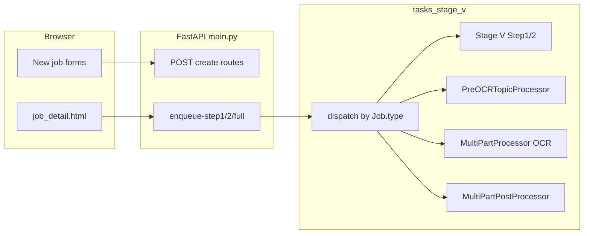

# Custom job types (Pre-OCR, OCR, Document processing)

## Current state (verified)

- **[`webapp/models.py`](webapp/models.py)** — `Job.type` is `String(32)`; reuse as-is with stable keys: `pre_ocr_topic`, `ocr_extraction`, `document_processing`.
- **[`webapp/main.py`](webapp/main.py)** — Test Bank create/detail/enqueue works; [`JOB_STAGE_LABELS`](webapp/main.py) already maps `document_processing` / `stages_1_4`; **missing** explicit entries for `pre_ocr_topic` and `ocr_extraction`.
- **[`webapp/tasks_stage_v.py`](webapp/tasks_stage_v.py)** — `run_step1_job` / `run_step2_job` / `run_full_pipeline_job` **always** run Stage V (`build_stage_v_processor()`). New job types would incorrectly execute Test Bank code until dispatch is added.
- **[`webapp/processor_context.py`](webapp/processor_context.py)** — Only exposes Stage V; needs factories for [`PreOCRTopicProcessor`](pre_ocr_topic_processor.py), [`MultiPartProcessor`](multi_part_processor.py), [`MultiPartPostProcessor`](multi_part_post_processor.py) using the same [`UnifiedAPIClient`](unified_api_client.py) + [`StageSettingsManager`](stage_settings_manager.py) pattern as the GUI.
- **[`webapp/default_prompts.py`](webapp/default_prompts.py)** — Only Test Bank Step 1/2; extend with getters reading **`prompts.json`** keys: `"Pre OCR Topic"`, `"OCR Extraction Prompt"`, `"Document Processing Prompt"` (already present in repo root [`prompts.json`](prompts.json)).
- **[`webapp/templates/base.html`](webapp/templates/base.html)** — Sidebar: Jobs + New Test Bank only; add **Custom Jobs** + per-type “New …” links as requested.
- **[`webapp/templates/job_detail.html`](webapp/templates/job_detail.html)** — Hard-coded Test Bank pairing labels (“Stage J” / “Word”), Step 1/2 sections, and poll JS uses fixed `STEP1_ROLES` / `STEP2_ROLES`; single-stage jobs need conditional layout and role lists so outputs poll correctly.

## 1. Constants, labels, list status

- Define **`SINGLE_STAGE_JOB_TYPES`** (`frozenset`) in [`webapp/main.py`](webapp/main.py) (or small `webapp/job_types.py` imported by main + tasks to avoid cycles).
- Extend **`JOB_STAGE_LABELS`**: `pre_ocr_topic` → “Pre-OCR Topic Extraction”, `ocr_extraction` → “OCR Extraction” (keep existing `document_processing` aliases).
- **`effective_job_list_status`**: For single-stage jobs, either **mirror completion on both pair steps** when the worker finishes (set `step1_status` and `step2_status` to the same terminal state), **or** add a small branch so list status reflects success when step1 succeeded. Pick one approach and use it consistently in the runner (mirroring is simplest and matches existing “all pairs both steps succeeded” logic).

## 2. Pairing + upload conventions (reuse `JobPair`)

Align with the existing internal plan and desktop behavior:

| `Job.type` | Per pair | `stage_j_*` | `word_*` | Notes |
|------------|----------|-------------|----------|--------|
| `pre_ocr_topic` | One PDF | PDF in `pair_n/inputs/` | empty / `None` | Runner: `process_pre_ocr_topic` |
| `ocr_extraction` | Topic JSON + PDF | Topic JSON | PDF | Same columns as Test Bank; **different labels** on detail page |
| `document_processing` | One OCR JSON | OCR JSON file | optional empty | Optional job-level PointId `.txt` in `config_json` + under `job_root/` |

- Add **[`ocr_pdf_topic_pairing.py`](ocr_pdf_topic_pairing.py)** at project root (next to [`stage_v_pairing.py`](stage_v_pairing.py)): extract pure matching from [`main_gui.py`](main_gui.py) `select_folder_and_match_ocr_pairs` / `_extract_book_chapter_from_pdf_name` / metadata fallback (~5873–5950). Export e.g. `auto_pair_ocr_topic_pdf_files(topic_paths, pdf_paths) -> list[dict]` for the POST handler.

## 3. Processor wiring (`processor_context`)

- Add builders that return configured processors sharing **`UnifiedAPIClient`** + keys from env (same as [`build_stage_v_processor`](webapp/processor_context.py)).
- Respect stage routing: e.g. `api_client.set_stage("ocr_extraction")` where [`MultiPartProcessor.process_ocr_extraction_with_topics`](multi_part_processor.py) expects it.

## 4. Worker dispatch (`tasks_stage_v.py`)

- **`run_step1_job`**: After loading `job`, branch on `job.type`:
  - `test_bank` → existing Stage V loop (unchanged).
  - `pre_ocr_topic` → loop pairs: PDF path, `process_pre_ocr_topic`, `register_artifacts_under`, statuses, delay, cancel checks (reuse `_scalar_cancel_requested` / `_finalize_step1_cancelled` patterns).
  - `ocr_extraction` → `process_ocr_extraction_with_topics(pdf_path=word_abs, topic_file_path=j_abs, ...)`.
  - `document_processing` → resolve optional PointId path from `config_json`; `process_document_processing_from_ocr_json(ocr_json_path=j_abs, ...)`.
- **Completion**: Append logs; set job `status` / `finished_at`; call **`notify_step1_finished`** (see inbox tweak below).
- **`run_step2_job`**: At top, if `job.type in SINGLE_STAGE_JOB_TYPES`: log once and **return** (no Stage V). Guard protects Celery if enqueue slips through.
- **`run_full_pipeline_job`**: If single-stage, **`run_step1_job` only** (do not call `run_step2_job`).
- **[`webapp/main.py`](webapp/main.py) `enqueue_step2`**: If `job.type in SINGLE_STAGE_JOB_TYPES`, **`HTTPException(400)`** with a clear message (matches requirement #4 for gated steps — single-stage has no Step 2).

## 5. Inbox copy ([`webapp/inbox.py`](webapp/inbox.py))

- In **`notify_step1_finished`**, if job type is single-stage and success: title/body should **not** say “run Step 2” (e.g. “Job finished — outputs on the job page.”).

## 6. Routes and shared helpers ([`webapp/main.py`](webapp/main.py))

- **`GET /custom-jobs`** — hub page listing cards: links to each “New …” form + Test Bank (`/test-bank/new`).
- **Pre-OCR**: `GET /pre-ocr-topic/new`, `POST /jobs/pre-ocr-topic` — multipart: PDFs, `job_name`, prompt, provider, model, `delay_seconds`.
- **OCR extraction**: `GET /ocr-extraction/new`, `POST /jobs/ocr-extraction` — topic JSON files + PDF files → `auto_pair_ocr_topic_pdf_files`; same config fields.
- **Document processing**: `GET /document-processing/new`, `POST /jobs/document-processing` — multiple OCR JSON files; optional PointId upload; prompt/provider/model/delay.

Shared helpers (reduce duplication with Test Bank pattern):

- Validate **`job_name`** (reuse rules from Test Bank create).
- **`_safe_copy_uploads` / `_build_job_pairs_from_specs`** pattern: create `job_root`, `Job`, `JobPair` rows, `register_input_artifact` with roles like `upload_pdf`, `upload_topic_json`, `upload_ocr_json`, etc.
- Redirect **`302` → `/jobs/{job_id}`** on success.
- Mirror **`if HAS_MULTIPART`** / stub `503` for POST when multipart unavailable (same as Test Bank).

All routes use existing **`CurrentUser`** dependency — same auth as Test Bank.

## 7. Templates

- **[`webapp/templates/custom_jobs.html`](webapp/templates/custom_jobs.html)** — simple card layout consistent with [`test_bank_new.html`](webapp/templates/test_bank_new.html) / `.card` styling.
- **`pre_ocr_topic_new.html`**, **`ocr_extraction_new.html`**, **`document_processing_new.html`** — same structure: job name card, file inputs, prompt textarea (defaults from context), provider/model row, delay, submit; **`multipart_ok`** warning like Test Bank.

**Job detail** ([`job_detail.html`](webapp/templates/job_detail.html)):

- Pass flags from `job_detail` view: e.g. `job_ui_mode` (`test_bank` | `single_stage`), **`pair_column_labels`**, **`show_step2`** / **`show_full_pipeline`**, **`output_roles_step1`** (and optionally step2) for poll JS.
- **Test Bank**: unchanged behavior and copy.
- **Single-stage**: One primary **Run** action (reuse `#btn-s1` + `enqueue-step1` to avoid rewriting JS); **hide** Step 2 card and full-pipeline block; adjust pairing table headers (Topic JSON / PDF / OCR JSON as appropriate); optionally hide Word-only pairing instructions.
- **Poll script**: Drive `STEP1_ROLES` / `STEP2_ROLES` from server-injected JSON arrays so generic `output` / JSON artifacts appear under the single outputs table; soften banners (“Step 1 finished → run Step 2”) when `single_stage`.

Server-side: extend **[`split_artifacts_for_steps`](webapp/main.py)** (or helper) so single-stage jobs bucket outputs into **`step1_artifacts`** for initial HTML render; keep **`other_artifacts`** for uploads.

## 8. Artifact roles ([`webapp/job_files.py`](webapp/job_files.py))

- Optionally extend **`register_artifacts_under`** filename heuristics so OCR / doc-processing JSON outputs map to predictable roles (e.g. files named like `OCR Extraction.json`) — improves preview tables without fragile JS.

## 9. Navigation and jobs list

- **[`base.html`](webapp/templates/base.html)** — Under Workspace: **Jobs**, **Custom Jobs**, **New Test Bank**, plus links for **New Pre-OCR**, **New OCR Extraction**, **New Document Processing** (paths chosen to match routes above). Use `request.url.path.startswith(...)` for `active` classes.
- **[`jobs_list.html`](webapp/templates/jobs_list.html)** — Empty state: link to **`/custom-jobs`** in addition to Test Bank.

## 10. Documentation (deliverable)

- Add **[`webapp/JOB_TYPES.md`](webapp/JOB_TYPES.md)** — short checklist: add `Job.type` string → `JOB_STAGE_LABELS` → GET/POST + template → pairing/input convention → `tasks_stage_v` branch → artifact/detail UI hooks → enqueue guards.

## Verification (manual)

- Create Test Bank → still Stage V only; Step 1/2 gating unchanged.
- Create each new type → appears on `/jobs` with correct **Stage** label; open detail → **Run** queues correct processor (inspect logs / outputs).
- Single-stage: Step 2 enqueue returns **400**; full pipeline does not run Stage V step 2.
- Worker: existing Celery task names unchanged ([`webapp/celery_tasks.py`](webapp/celery_tasks.py)); dispatch is entirely inside `run_step1_job` / `run_full_pipeline_job`.
