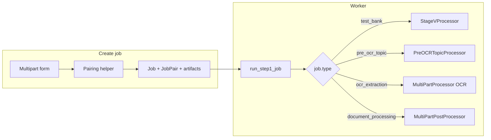

# Custom job types (Pre-OCR, OCR, Document processing)

## Current architecture (what we extend)

- **Storage**: [`webapp/models.py`](webapp/models.py) `Job` (`type`, `status`, `config_json`) + `JobPair` (`step1_status` / `step2_status`, `stage_j_relpath`, `word_relpath`) + `Artifact` + `JobLogLine` — unchanged.
- **Create pattern**: [`webapp/main.py`](webapp/main.py) `POST /jobs/test-bank` — temp upload → `auto_pair_stage_v_files` → `job_root` + `JobPair` rows + `register_input_artifact` → redirect `/jobs/{id}`.
- **Run pattern**: [`webapp/tasks_stage_v.py`](webapp/tasks_stage_v.py) `run_step1_job` / `run_step2_job` / `run_full_pipeline_job` — **today these always call `build_stage_v_processor()` and Stage V** (no `job.type` branch). This must be fixed as part of this work so new types do not run Test Bank code.
- **Detail UX**: [`webapp/templates/job_detail.html`](webapp/templates/job_detail.html) — Word pairing, Step 1/2 buttons, poll, artifact tables. JS assumes Test Bank gating for step 2; single-stage jobs need a different layout/labels.

## Job type strings and labels

Use stable `Job.type` values (fit `String(32)`):

| `Job.type` | User-facing label (add to `JOB_STAGE_LABELS`) |
|------------|-----------------------------------------------|
| `pre_ocr_topic` | Pre-OCR Topic Extraction |
| `ocr_extraction` | OCR Extraction |
| `document_processing` | Document Processing (key already exists; keep aliases) |

Add any **stage_* aliases** you already use elsewhere (e.g. match `unified_api_client` stage names) for consistent list display.

## File / pair conventions (no schema migration)

Reuse `JobPair` by storing inputs as relpaths under `pair_{i}/inputs/…` and registering [`webapp/job_files.py`](webapp/job_files.py) artifacts.

- **`pre_ocr_topic`**: One pair per PDF. Store PDF as the “primary” input: e.g. `stage_j_relpath` = `pair_n/inputs/<file>.pdf`, `stage_j_filename` = basename, `word_relpath` = `None`, `word_filename` = `""`. Runner calls `PreOCRTopicProcessor.process_pre_ocr_topic` ([`pre_ocr_topic_processor.py`](pre_ocr_topic_processor.py)).
- **`ocr_extraction`**: One pair per (topic JSON + PDF). Match desktop ordering: **topic JSON → `stage_j_*`, PDF → `word_*`** (same columns as Test Bank but different semantics on the detail page — label columns “Topic JSON” / “PDF”). Runner calls `MultiPartProcessor.process_ocr_extraction_with_topics` ([`multi_part_processor.py`](multi_part_processor.py)).
- **`document_processing`**: One pair per OCR Extraction JSON file. `stage_j_relpath` → OCR JSON; optional PointId mapping: store once at job level in `config_json` (path relative to job root) if uploaded; runner passes path into `MultiPartPostProcessor.process_document_processing_from_ocr_json` ([`multi_part_post_processor.py`](multi_part_post_processor.py)).

**Pairing helper for OCR**: Extract the matching logic from [`main_gui.py`](main_gui.py) (`select_folder_and_match_ocr_pairs`, ~5873+) into a pure module e.g. [`ocr_pdf_topic_pairing.py`](ocr_pdf_topic_pairing.py) (same spirit as [`stage_v_pairing.py`](stage_v_pairing.py)), returning `{topic_path, pdf_path}` specs for web creation.

## Single-stage vs Test Bank (step fields)

These three types are **single runnable stage** in the desktop sense (one API pipeline per pair). To keep [`effective_job_list_status`](webapp/main.py) and the jobs list correct (it expects both steps for full success):

- On successful completion of the worker for a single-stage type, set **both** `step1_status` and `step2_status` to `succeeded` (and mirror failure similarly), **or** document a dedicated branch in `effective_job_list_status` for `SINGLE_STAGE_JOB_TYPES`. Pick one approach and apply consistently.
- **`enqueue_step2`** / **`run_step2_job`**: For `job.type in SINGLE_STAGE_JOB_TYPES`, **reject enqueue with 400** (clear message) and **no-op or guard** inside `run_step2_job` so Stage V is never invoked accidentally.
- **`run_full_pipeline_job`**: For single-stage types, run only the single-stage runner (do **not** call `run_step2_job` afterward). Test Bank behavior unchanged.

## Task runner wiring

1. **`webapp/processor_context.py`**: Add a small factory (e.g. `build_unified_client_and_settings()` + lazy imports of `PreOCRTopicProcessor`, `MultiPartProcessor`, `MultiPartPostProcessor`) so workers reuse the same `UnifiedAPIClient` + `StageSettingsManager` pattern as Stage V.
2. **`webapp/tasks_stage_v.py`** (or a new `webapp/tasks_job_dispatch.py` imported from `tasks_stage_v`):
   - At the **top** of `run_step1_job`, load `job.type` and **dispatch**:
     - `test_bank` → existing Stage V Step 1 loop (unchanged).
     - `pre_ocr_topic` / `ocr_extraction` / `document_processing` → new handlers that iterate pairs, honor `delay_seconds` + cancel, append logs, `register_artifacts_under`, update statuses, call inbox helpers ([`webapp/inbox.py`](webapp/inbox.py)).
   - Adjust **`notify_step1_finished`** copy for single-stage jobs (avoid “run Step 2” when irrelevant) — small conditional in [`webapp/inbox.py`](webapp/inbox.py) or pass context.

**Celery** ([`webapp/celery_tasks.py`](webapp/celery_tasks.py)): Keep existing task names; dispatch happens inside `run_step1_job` / `run_full_pipeline_job` so no new Celery entries are strictly required.

## Routes and shared helpers ([`webapp/main.py`](webapp/main.py))

- **GET** `/custom-jobs` — “Custom Jobs” hub listing cards/links: Pre-OCR, OCR Extraction, Document Processing, plus **New Test Bank** (reuse `/test-bank/new`).
- **GET + POST** for each type (mirror Test Bank structure):
  - `/pre-ocr-topic/new` + `POST /jobs/pre-ocr-topic`
  - `/ocr-extraction/new` + `POST /jobs/ocr-extraction`
  - `/document-processing/new` + `POST /jobs/document-processing`

Extract shared logic into helpers e.g. `_save_uploaded_job(...)`, `_parse_delay_seconds`, validation errors → `HTTPException(400)` with user-facing messages.

**Forms** (new templates, styled like [`webapp/templates/test_bank_new.html`](webapp/templates/test_bank_new.html)):

- Common: `job_name`, `multipart_ok`, default prompts via new helpers in [`webapp/default_prompts.py`](webapp/default_prompts.py) reading [`prompts.json`](prompts.json) keys: `"Pre OCR Topic"`, `"OCR Extraction Prompt"`, `"Document Processing Prompt"` (same sources as desktop).
- Pre-OCR: multiple PDFs; prompt; provider/model (defaults aligned with GUI: e.g. Google / `gemini-2.5-pro`).
- OCR extraction: multiple PDFs + multiple topic JSONs; pairing via `ocr_pdf_topic_pairing`; prompt; provider/model (Gemini-style defaults).
- Document processing: multiple OCR JSON files; prompt; provider/model (DeepSeek defaults per GUI); optional PointId `.txt` upload stored under job root and path recorded in `config_json`.

All successful creates → **302** to `/jobs/{job_id}`.

## Job detail template ([`webapp/templates/job_detail.html`](webapp/templates/job_detail.html))

Pass flags from `job_detail` route, e.g. `job_ui = "test_bank" | "single_stage" | …`, `pair_columns` labels:

- **Test Bank**: Keep current pairing + Step 1 + Step 2 + optional full pipeline block as today.
- **Single-stage types**: Hide Word-centric copy where wrong; show **inputs table** appropriate to type; show **one primary “Run”** section (reuse Step 1 button id `btn-s1` so minimal JS change) and **hide or collapse Step 2** (no misleading second stage). Hide **“Run full pipeline”** for these types (or map it to the same single enqueue — prefer hiding for clarity).
- Update poll JS `STEP1_ROLES` / `STEP2_ROLES` **or** extend [`webapp/job_files.py`](webapp/job_files.py) `register_artifacts_under` role guessing so outputs appear under Step 1 / “Outputs” for these jobs (e.g. treat key output filenames as `step1_combined` / `output`).

## Navigation and jobs list

- [`webapp/templates/base.html`](webapp/templates/base.html): Add sidebar link **Custom Jobs** → `/custom-jobs` (keep **New Test Bank** if desired or fold into hub only — recommend hub + keep Test Bank link for muscle memory).
- [`webapp/templates/jobs_list.html`](webapp/templates/jobs_list.html): Broaden empty-state copy to point at `/custom-jobs`.

## README note (requested)

Add a short section to an existing doc or a small **[`webapp/JOB_TYPES.md`](webapp/JOB_TYPES.md)** (or README fragment): list steps to add a job type — define `Job.type` string, add label, create GET/POST routes + template, implement dispatcher branch + pair/input convention, add artifact role mapping for previews, extend `job_detail` flags.

## Verification checklist

- Creating Test Bank still creates pairs and runs Stage V unchanged.
- Creating each new type persists `config_json`, shows correct stage label on `/jobs`.
- Queuing Step 1 runs the **correct** processor (not Stage V).
- Single-stage jobs reach **succeeded** on list page when work completes; Step 2 cannot be queued erroneously.

