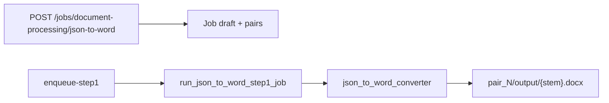

# JSON → Word (Document Processing export)

## Goal

New job type **`document_processing_json_to_word`**: upload one or more **Document Processing** JSON files (`Lesson_file_*.json` with top-level **`points`**), run conversion (no LLM), download **`.docx`** per pair from the job detail page.

**Heading mapping** (emit only when the value changes vs. the previous row, and skip empty strings):

| JSON field | Word style |
|------------|------------|
| `chapter` | Heading 1 |
| `subchapter` | Heading 2 |
| `topic` | Heading 3 |
| `subtopic` | Heading 4 |
| `subsubtopic` | Heading 5 |
| `points` (body) | Normal paragraph |

## Input contract (strict)

Accept only JSON matching Document Processing final output:

- Top-level **`points`**: non-empty `list` of objects (required).
- Reject files that only have `data` / `rows` / nested `chapters` (per your choice: doc-proc-only).
- Optional soft check: `metadata.processing_status == "completed"` — log a warning if missing, do not block (partial files may still be useful).

Row field resolution (case-insensitive keys, same spirit as [`json_to_csv_converter.py`](json_to_csv_converter.py)):

- Hierarchy: `chapter`, `subchapter`, `topic`, `subtopic`, `subsubtopic`
- Body: `points` or `Points` → paragraph text; skip row if body is empty after strip

Preserve **file order** of `points` (no sorting).

## Core module: `json_to_word_converter.py` (project root)

New module alongside [`json_to_csv_converter.py`](json_to_csv_converter.py):

- `validate_document_processing_json(data) -> list[dict]` — load JSON, enforce `points` array.
- `convert_points_to_docx(points, output_path) -> bool` using **`python-docx`** (already in [`requirements.txt`](requirements.txt)):
  - `Document()`, track last seen values for each hierarchy level.
  - On change: `doc.add_heading(text, level=N)` for N in 1..5.
  - Then `doc.add_paragraph(body)` for each point.
- `convert_json_file_to_docx(json_path, docx_path) -> bool` — read UTF-8, validate, write docx.

**RTL note:** Content is Persian/English mixed. Initial version uses default paragraph/heading styles (no custom bidi). If Word opens LTR, a follow-up can set paragraph RTL via `python-docx` OXML for Persian-heavy exports.

## Web job wiring (mirror JSON → CSV)

Pattern reference: [`webapp/json_to_csv_jobs.py`](webapp/json_to_csv_jobs.py), [`run_json_to_csv_step1_job`](webapp/tasks_single_stage.py), [`_create_json_to_csv_stage_job`](webapp/main.py).

| File | Change |
|------|--------|
| [`webapp/json_to_word_jobs.py`](webapp/json_to_word_jobs.py) | New: `JSON_TO_WORD_JOB_TYPES`, labels, page context |
| [`webapp/job_runner_common.py`](webapp/job_runner_common.py) | Add `"document_processing_json_to_word"` to `SINGLE_STAGE_JOB_TYPES` |
| [`webapp/tasks_single_stage.py`](webapp/tasks_single_stage.py) | `run_json_to_word_step1_job` — same loop as CSV runner: read `pair.stage_j_relpath`, write `pair_{n}/output/{stem}.docx`, `register_artifacts_under`, cancel/finalize like CSV |
| [`webapp/tasks_stage_v.py`](webapp/tasks_stage_v.py) | Dispatch `jt == "document_processing_json_to_word"` → new runner |
| [`webapp/main.py`](webapp/main.py) | `JOB_STAGE_LABELS`; GET `/document-processing/json-to-word/new`; POST `/jobs/document-processing/json-to-word`; stub when `HAS_MULTIPART` is false |
| [`webapp/templates/json_to_word_new.html`](webapp/templates/json_to_word_new.html) | Job name + multi JSON upload (`Lesson_file_*.json`) |
| [`webapp/templates/base.html`](webapp/templates/base.html) | Nav link (e.g. under Document Processing area or near JSON to CSV) |
| [`webapp/templates/jobs_list.html`](webapp/templates/jobs_list.html) | Link in empty-state help text |
| [`webapp/templates/job_detail.html`](webapp/templates/job_detail.html) | Copy for inputs/outputs; button label **Convert to Word** |

No LLM prompts: do **not** add to [`webapp/prompt_keys.py`](webapp/prompt_keys.py).

## UX copy

- Page title: **Document Processing → Word**
- Description: upload **`Lesson_file_*.json`** from a completed Document Processing job; output uses Word Heading 1–5 for chapter → subsubtopic.

Optional later: link from [`document_processing_new.html`](webapp/templates/document_processing_new.html) / job detail (“Export to Word”) — not required for v1.

## Out of scope (v1)

- Desktop GUI tab (can call the same converter later).
- Nested OCR `chapters` JSON, Stage J/TA `data` arrays, CSV-style multi-format flattening.
- `.doc` (legacy binary) output — **`.docx` only**.

## Verification

1. Use existing sample with `points`-like rows if available, or a small `Lesson_file_*.json` from a completed Document Processing run.
2. Create job via web form, run step 1, open `.docx`: confirm heading levels and that headings appear once per hierarchy change, body text under correct sections.
3. Confirm invalid JSON (no `points`) fails the pair with a clear error in job log.
