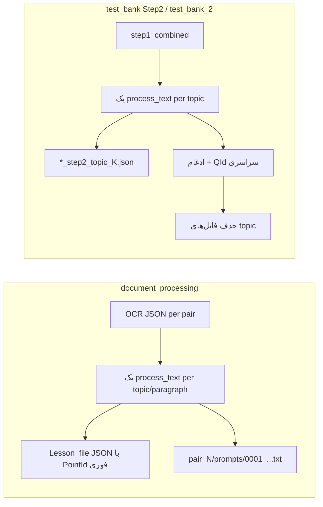
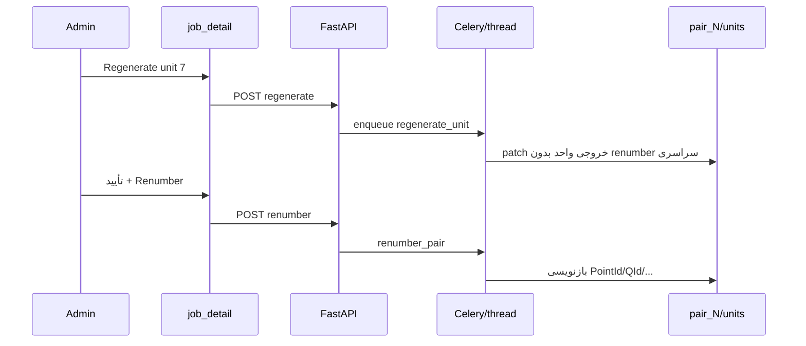

# Regenerate واحد LLM + Renumber دستی

## وضعیت فعلی



- هر فراخوانی LLM در [`webapp/prompt_capture.py`](webapp/prompt_capture.py) با `call_sequence` ذخیره می‌شود، اما **بدون** نام topic/paragraph و **بدون** لینک به واحد قابل Regenerate.
- Document Processing در [`multi_part_post_processor.py`](multi_part_post_processor.py) بلافاصله `PointId` می‌دهد و در پایان `raw_responses` را حذف می‌کند (خطوط 1743–1746).
- Test Bank Step 2 در [`stage_v_processor.py`](stage_v_processor.py) بعد از combine فایل‌های per-topic را پاک می‌کند (خطوط 500–504).
- UI در [`webapp/templates/job_detail.html`](webapp/templates/job_detail.html) فقط Run کل مرحله + لیست artifact دارد؛ endpoint مخصوص Regenerate/Renumber وجود ندارد.
- `pair_indices` در [`webapp/main.py`](webapp/main.py) فقط **کل pair** را دوباره اجرا می‌کند، نه یک ریکوئست.

## هدف محصول (طبق توافق شما)

1. ادمین واحد خراب را در لیست ریکوئست‌های همان pair ببیند و **Regenerate** کند.
2. بعد از Regenerate (و هر ویرایش دستی)، **شماره‌گذاری ترتیبی جدا** انجام شود — فقط با دکمه **Renumber** بعد از تأیید «فایل اوکی است».
3. پوشش: **همه jobهای وب که بیش از یک `process_text` در هر pair دارند** (با آداپتر per-type).

## معماری پیشنهادی



### 1) Manifest واحدها (منبع حقیقت روی دیسک)

برای هر `pair_index` فایل:

`jobs/{job_id}/pair_{N}/units/manifest.json`

```json
{
  "job_type": "document_processing",
  "units": [
    {
      "unit_index": 3,
      "label": "فصل X > زیرفصل Y > موضوع Z",
      "chapter": "...",
      "subchapter": "...",
      "topic": "...",
      "prompt_seq": 3,
      "status": "succeeded",
      "artifact_relpath": "pair_0/units/003_topic_....json"
    }
  ],
  "renumber": {
    "scheme": "pointid",
    "start_id": "1050030001",
    "last_applied_at": null
  }
}
```

- در **اولین اجرای عادی** manifest ساخته/به‌روز می‌شود (نه فقط هنگام Regenerate).
- [`prompt_capture.py`](webapp/prompt_capture.py): پارامتر اختیاری `unit_index` / `unit_label` در نام فایل و هدر dump (مثلاً `0003_u003_topicFoo_step1.txt`).

### 2) ماژول مشترک آداپترها

فایل جدید پیشنهادی: [`webapp/unit_repair/registry.py`](webapp/unit_repair/registry.py)

| Job type | واحد LLM | فیلد ترتیبی | استراتژی merge |
|----------|-----------|-------------|----------------|
| `document_processing` | topic/paragraph | `PointId` | حذف points همان `(chapter,subchapter,topic)` + جایگزینی از خروجی واحد |
| `test_bank`, `test_bank_2` | topic (Step 2) | `QId` (+ `TestID` محلی) | به‌روزرسانی `step2_topic_K.json` + rebuild `final_b_json` |
| `image_notes` | topic | `PointId` | patch ردیف‌های image notes همان topic |
| `table_notes` | topic | `PointId` | patch ردیف‌های table notes همان topic |
| `ocr_extraction` | subchapter (یا batch صفحه) | — | Regenerate + merge JSON؛ Renumber غیرفعال |
| سایر (flashcard، importance_type اگر چند call) | per-type | per-type | آداپتر با `renumber_supported: false` در صورت نیاز |

توابع مشترک:

- `build_manifest(job, pair)` — از لاگ/خروجی فعلی
- `regenerate_unit(job_id, pair_index, unit_index)` — یک LLM call
- `renumber_pair(job_id, pair_index)` — فقط وقتی ادمین دکمه زد

منطق **Renumber PointId** (مشترک doc proc / image / table):

- ترتیب واحدها = `unit_index` در manifest.
- داخل هر واحد ترتیب فعلی points حفظ شود.
- `start_id` از `config_json` (`start_pointid` یا خط `pointid_mapping` برای همان pair) یا آخرین PointId ثابت قبلی.
- الگوی 10 رقمی `BBBCCCPPPP` (همان [`base_stage_processor.py`](base_stage_processor.py)).

منطق **Renumber QId** (Test Bank Step 2):

- ترتیب = `topic_idx` در manifest.
- `book_id` / `chapter_id` از نام فایل Stage J یا metadata.
- بازسازی `final_b_json` از همه `units/*.json` سپس `QId` از `0001` تا `N` (مطابق combine فعلی در `stage_v_processor.py` خطوط 484–495).

### 3) تغییرات پردازشگر (حداقل برای pilot + قابل گسترش)

**Document Processing** — [`multi_part_post_processor.py`](multi_part_post_processor.py):

- استخراج متد `process_document_processing_unit(...)` از حلقه فعلی (خطوط 1525–1713).
- در Regenerate: **بدون** assign نهایی PointId سراسری (یا assign موقت با flag `ids_provisional` در metadata) تا ادمین Renumber بزند.
- نگه‌داشتن کپی per-unit در `pair_N/units/` حتی بعد از finalize (دیگر حذف کامل `raw_responses` بدون sidecar).

**Stage V Step 2** — [`stage_v_processor.py`](stage_v_processor.py):

- `regenerate_step2_unit(topic_idx, ...)`: فراخوانی `_step2_refine_questions_and_add_qid` با `assign_qid=False`.
- `combine_step2_from_units(output_dir)`: همان منطق combine؛ **حذف خودکار** فایل topic بعد از combine → **اختیاری** با flag `keep_unit_artifacts=True` برای وب.

**Image / Table notes** — [`stage_e_processor.py`](stage_e_processor.py), [`stage_ta_processor.py`](stage_ta_processor.py):

- همان الگو: manifest per topic + `regenerate_topic` + `renumber_pointids_from_manifest`.

**OCR extraction** — [`multi_part_processor.py`](multi_part_processor.py):

- manifest per subchapter؛ Regenerate؛ بدون دکمه Renumber در UI.

### 4) API و Worker

در [`webapp/main.py`](webapp/main.py):

| Method | Path | کار |
|--------|------|-----|
| GET | `/jobs/{id}/pairs/{pi}/units` | لیست manifest + لینک prompt/خروجی |
| POST | `/jobs/{id}/pairs/{pi}/units/{ui}/regenerate` | صف worker |
| POST | `/jobs/{id}/pairs/{pi}/renumber` | body: `{ "confirm": true }` — فقط admin |

- تسک Celery جدید در [`webapp/celery_tasks.py`](webapp/celery_tasks.py): `regenerate_unit_task`, `renumber_pair_task` (یا inline مثل `enqueue_task` فعلی).
- قفل ساده per `(job_id, pair_index)` تا دو Regenerate همزمان یک pair را خراب نکند.
- لاگ در `JobLogLine` با `pair_index`.

### 5) UI ادمین

بخش جدید در [`webapp/templates/job_detail.html`](webapp/templates/job_detail.html) (برای job types با `supports_unit_repair`):

- جدول: `#`، برچسب واحد، وضعیت، لینک preview prompt capture، **Regenerate**.
- زیر جدول: چک‌باکس «خروجی را بررسی کردم» + دکمه **Renumber …** (متن بر اساس scheme: PointIds / QIds).
- Poll همان `/poll` یا endpoint units برای به‌روزرسانی وضعیت Regenerate.
- بنر هشدار اگر `renumber.last_applied_at` null و `ids_provisional` باشد.

### 6) فازبندی پیاده‌سازی (با scope «همه jobها»)

**فاز A — زیرساخت (همه typeها)**

- manifest + prompt_capture metadata + registry + API + UI shell + worker hooks.

**فاز B — Pilot (بیشترین ارزش)**

- `document_processing` + `test_bank` / `test_bank_2` (PointId / QId).

**فاز C — گسترش**

- `image_notes`, `table_notes`, `ocr_extraction`, سپس بقیه typeهای چند‌ریکوئستی (flashcard و …) با آداپتر؛ typeهای تک‌ریکوئستی در registry با `multi_unit: false` (بخش UI مخفی).

### 7) تست

- Unit test برای `renumber_pointids` و `renumber_qids` روی fixture JSON کوچک (الگوی [`test_stage_v_threading.py`](test_stage_v_threading.py)).
- تست یکپارچه: Regenerate واحد میانی → شماره‌ها قدیمی/گaps → Renumber → ترتیب پیوسته.

## ریسک‌ها

- **حجم manifest**: jobهای بزرگ OCR/doc proc — pagination در GET units.
- **test_bank_2**: فقط Step 2؛ Renumber فقط روی `final_b_json` همان pair.
- **همزمانی**: Regenerate حین Run کل job — باید job در حالت `running` دکمه Regenerate را disable کند.

## فایل‌های اصلی تحت تغییر

- [`webapp/prompt_capture.py`](webapp/prompt_capture.py) — metadata واحد
- [`webapp/unit_repair/`](webapp/unit_repair/) — جدید
- [`webapp/main.py`](webapp/main.py) — routes
- [`webapp/celery_tasks.py`](webapp/celery_tasks.py) — tasks
- [`webapp/templates/job_detail.html`](webapp/templates/job_detail.html) — UI
- [`multi_part_post_processor.py`](multi_part_post_processor.py), [`stage_v_processor.py`](stage_v_processor.py) — refactor + keep artifacts
- [`stage_e_processor.py`](stage_e_processor.py), [`stage_ta_processor.py`](stage_ta_processor.py), [`multi_part_processor.py`](multi_part_processor.py) — فاز C
