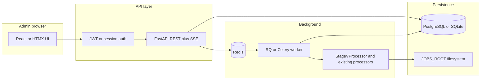

# Server web app for Content Automation (Tkinter replacement)

## What you have today (anchor points)

- **Test Bank Generation** is implemented in [`main_gui.py`](main_gui.py): tab `"Test Bank Generation"` → `setup_stage_v_ui` → **`process_stage_v_batch`**, which loops valid `(stage_j_path, word_path)` pairs and calls **`StageVProcessor.process_stage_v`** with Step 1/2 prompts, providers, models, optional delay between pairs—same pattern as lines ~9395–9613 in [`main_gui.py`](main_gui.py).
- **Core logic** lives in [`stage_v_processor.py`](stage_v_processor.py): Step 1 + Step 2 API calls, writes **multiple artifacts** under the output dir (e.g. `step1_combined_*.json`, per-topic `*_stage_v_step1_*` / `*_stage_v_step2_*`, final `b*.json`), and emits lines via `progress_callback`.
- **Full PDF→pipeline** exists in [`automated_pipeline_orchestrator.py`](automated_pipeline_orchestrator.py) (`AutomatedPipelineOrchestrator.run_automated_pipeline`). Your repo already has an internal plan sketch at [`.cursor/plans/server_web_app_parity_375ba893.plan.md`](.cursor/plans/server_web_app_parity_375ba893.plan.md) (FastAPI, Redis worker, artifacts on FS)—this delivery plan aligns with that and adds **3 admins**, explicit **Test Bank** scope, and **DB + file integration**.

## Goals (mapped to your requirements)

| Requirement | Approach |
|-------------|----------|
| Same behavior as Test Bank tab | Worker invokes **`process_stage_v`** with the same arguments the GUI passes (prompts, `provider_1/2`, `model_name_1/2`, `stage_settings_manager`, `output_dir`, `progress_callback`). |
| Every stage/step visible + downloadable | **Logs**: persist `progress_callback` lines (and optional stderr) per job/pair. **Files**: after each pair (and optionally periodically), **register every file** under the job/pair output directory as an artifact row (Step 1 combined, per-topic JSONs, final `b*.json`, any `.txt` dumps). |
| Big JSON review | **Never** return multi‑MB JSON as one browser payload by default: **`GET .../preview` with `offset`/`limit`** (UTF-8 slice + total size), plus **full file download** and optional lazy JSON tree later. |
| 3 admins + auth | **`users` table** with bcrypt password hashes; seed **3 admin users** via migration or env bootstrap (`ADMIN_EMAIL_1`… or single JSON seed file). **JWT (HttpOnly cookie)** or session cookies with CSRF for cookie-based SPAs. |
| Postgres or SQLite + JSON tied to DB | **Binary/large JSON on disk** under `JOBS_ROOT/<job_id>/...`; DB holds **`artifacts`** rows: `path`, `kind`, `bytes`, `sha256`, `job_id`, `pair_index`, `logical_step` (nullable). Optional **`artifact_chunks`** only if you later need ranged reads without FS—but mmap/readslice from FS is enough for v1. |
| Fast delivery | **Phase 1** ships **Auth + jobs + Test Bank batch + downloads + log stream + JSON preview**. **Phase 2** wires remaining GUI tabs to the same pattern (or full orchestrator UI). |

## Target architecture

**Why a worker:** Stage V can run for a long time (many pairs, API latency). HTTP requests should enqueue work and return `job_id` immediately; **SSE** (`/jobs/{id}/events`) streams `progress_callback` lines.

**Recommended stack (speed vs maintenance):**

- **FastAPI** + **SQLAlchemy 2.x** + **Alembic** (schema migrations).
- **RQ + Redis** (simpler ops than Celery for one worker type) *or* Celery if you already know it.
- **SQLite** for single-server MVP; **PostgreSQL** for production (same SQLAlchemy models; swap `DATABASE_URL`).
- **Frontend:** **HTMX + Jinja** or **React/Vite**—for fastest admin CRUD + SSE, HTMX often wins; for heavy JSON UX, React + `@monaco-editor/json` or **react-json-view-lite** with chunked fetch.

## Data model (minimal but sufficient)

- **`users`**: `id`, `email` (unique), `password_hash`, `is_active`, `created_at`.
- **`jobs`**: `id`, `type` (`test_bank`, …), `status`, `created_by_user_id`, `created_at`, `started_at`, `finished_at`, `error_summary`.
- **`job_pairs`** (for Test Bank): `job_id`, `pair_index`, `stage_j_filename`, `word_filename`, `status`, `error_message`, `output_dir` (relative).
- **`artifacts`**: `id`, `job_id`, `pair_index` (nullable), `relative_path`, `role` (`upload_stage_j`, `upload_word`, `step1_combined`, `step1_topic`, `step2_topic`, `final_output`, `log`, …), `byte_size`, `sha256`, `created_at`.

**Integration rule:** On disk layout, mirror something stable like:

`JOBS_ROOT/<job_id>/pair_<n>/inputs/` and `.../outputs/` so backups and DB rows stay aligned.

## API surface (Phase 1)

- **`POST /auth/login`**, **`POST /auth/logout`**, **`GET /auth/me`** (protected).
- **`POST /jobs/test-bank`**: multipart **multiple** `stage_j_files[]`, `word_files[]`, JSON body fields for prompts/models/providers/delay (same semantics as GUI). Server saves uploads → builds pairs (**same Auto-Pair logic** as `_auto_pair_stage_v_files` in [`main_gui.py`](main_gui.py)—extract that into a small pure function `pair_stage_v_files(names)` shared by GUI and API to avoid drift).
- **`GET /jobs`**, **`GET /jobs/{id}`** (timeline + pairs + artifact list).
- **`GET /jobs/{id}/events`** (SSE): pipe worker log lines.
- **`GET /artifacts/{id}/download`**, **`GET /artifacts/{id}/preview?offset=&limit=`**.

## Worker behavior (Test Bank job)

1. Create job row + artifact rows for uploaded files.
2. For each pair: update pair status `running`, instantiate **`UnifiedAPIClient`** + **`StageSettingsManager`** + **`StageVProcessor`** the same way [`main_gui.py`](main_gui.py) constructs them (reuse env-based API keys).
3. Call `process_stage_v(...)` with a `progress_callback` that **appends to job log** and optionally **Redis pubsub** for SSE.
4. On success: **glob output directory** and insert **`artifacts`** for every new file (final + intermediates). Optionally compute SHA256 once.
5. On failure: store exception on `job_pairs` and continue or abort based on product choice (GUI continues per pair; mirror that).

## Phase 2 — “complete same functionality”

For each remaining tab in [`main_gui.py`](main_gui.py), follow the same recipe already documented in your parity plan: **identify the handler → thin service wrapper → endpoint + worker**. Priority candidates after Test Bank:

- **Automated pipeline** from PDF: expose orchestrator [`run_automated_pipeline`](automated_pipeline_orchestrator.py) with uploads + same kwargs as GUI; reuse `StageResult.to_dict()` for the timeline.
- **Standalone stages** (E, J, H, M, L, X, Y, Z, Reference Change): one job `type` per flow, same artifact registration pattern.

**Orchestrator note:** Your existing plan correctly flags optional **X/Y/Z** integration and signature alignment in [`automated_pipeline_orchestrator.py`](automated_pipeline_orchestrator.py)—track that as backend hardening when exposing full pipeline in the web UI.

## Deployment (single server)

- **`docker-compose`**: `api` (uvicorn/gunicorn), `worker`, `redis`, optional `postgres`; volume mount **`JOBS_ROOT`**.
- **Reverse proxy** (nginx/Caddy): large **`client_max_body_size`**, long timeouts for uploads, disable buffering for **SSE**.
- **Secrets:** `.env` — `DATABASE_URL`, `REDIS_URL`, `JWT_SECRET`, `OPENROUTER_API_KEY` (your project already centralizes keys via env as in GUI), **bootstrap admin passwords** (only on first deploy).

## Testing checklist (Phase 1)

- Login as each of 3 admins; confirm isolation only where intended (jobs visible to all admins vs per-user—**recommend all admins see all jobs** for operational simplicity unless you need row-level isolation).
- Upload multiple J + Word files; verify Auto-Pair matches GUI behavior.
- Confirm **SSE** shows Step 1 / Step 2 progress lines.
- Download **final `b*.json`** and at least one **intermediate** artifact; preview API returns first N KB without loading whole file server-side into response JSON.

## Realistic timeline

- **Phase 1 (Test Bank + infra):** roughly **3–5 focused dev-days** for one developer familiar with the repo (auth, DB, worker, UI shell, artifact plumbing).
- **Full GUI parity:** additive weeks depending on how many tabs you expose; reuse the same job/artifact pattern throughout.
