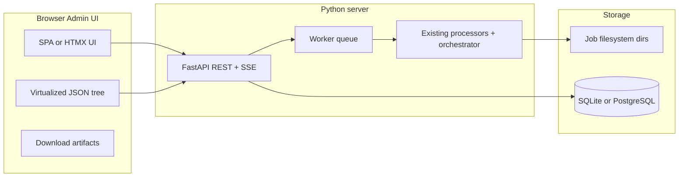

# Server web app (full GUI parity, 3-day track)

## Current codebase snapshot

- **UI today**: ~15k-line [main_gui.py](main_gui.py) (CustomTkinter) with tabs including Pre-OCR, OCR / OCR Paragraph, Document Processing, Stages E, TA, F, J, H, V, M, L, X, Y, Z, JSON→CSV, and Reference Change—plus a **main-screen automated pipeline** wired to [automated_pipeline_orchestrator.py](automated_pipeline_orchestrator.py).
- **Business logic**: Already lives in processor modules (`stage_*_processor.py`, [multi_part_processor.py](multi_part_processor.py), [reference_change_csv_processor.py](reference_change_csv_processor.py), etc.) and [unified_api_client.py](unified_api_client.py). The GUI mostly collects paths, prompts, models, and calls these functions.
- **Orchestrator gap**: `run_automated_pipeline` sets `stages_to_run = ["1","2","3","4","E","F","J","V"]` only—so **stages X, Y, Z never execute** in the automated run despite implementation blocks existing later in the same file. Those blocks also reference parameters (e.g. `old_book_pdf_path`, `stage_x_pdf_extraction_prompt`) that are **not** on the current function signature (lines 114–161), which would break if X/Y/Z were ever enabled without refactoring. This must be fixed as part of “full pipeline including X/Y/Z” parity.

## Target architecture

**Recommended stack (fastest path to parity)**

| Layer | Choice | Why |
|--------|--------|-----|
| HTTP API | **FastAPI** | Async, OpenAPI schemas, file uploads, SSE for logs |
| Long jobs | **RQ + Redis** or **Celery + Redis** | Pipeline/stages run minutes–hours; must not block request threads |
| Metadata DB | **PostgreSQL** (or **SQLite** for single-node MVP) | Jobs, stages, artifact paths, status, timestamps—relational fits “job → many artifacts” |
| Large JSON blobs | **Not in DB** by default | Store JSON on disk under `JOBS_ROOT/{job_id}/...`; DB holds path + size + optional SHA256 |
| Auth | **Single admin** (env `ADMIN_PASSWORD` + signed cookie/JWT) or HTTP Basic behind reverse proxy | Matches “admin review” requirement without building user management |

**MongoDB vs relational + files**

- Your payloads are **large JSON files** produced by stages; the natural pattern is **artifact files + metadata rows**. PostgreSQL/SQLite handles listings, filtering by status/date, and foreign keys cleanly.
- **MongoDB** is reasonable if you later need **rich queries inside arbitrary JSON** across many jobs without defining columns—but it adds deployment and backup complexity and does not remove the need for **streaming/large-document UX** in the browser (you still should not send 50MB documents as one JSON API response for rendering).
- **Practical recommendation for the 3-day window**: **PostgreSQL (or SQLite) + filesystem artifacts**. Add MongoDB only if a concrete query requirement appears that JSONB cannot satisfy.

## How to preserve “same functionality”

Do **not** reimplement pipelines in the frontend. For each GUI tab, mirror the existing handler pattern:

1. **Identify** the GUI method that runs the work (e.g. `_run_reference_change`, batch Stage H worker in [main_gui.py](main_gui.py)).
2. **Extract** (minimal) a pure-Python function or thin **service** module if needed: same arguments as today (`stage_j_path`, `prompt`, `model_name`, …), returning output path(s) and errors.
3. **Expose** via FastAPI: multipart uploads land in the job directory; the worker passes **absolute paths** into the same processor calls the GUI uses.

The OpenRouter / `.env` setup described in your existing migration plan remains the server-side config ([openrouter_api_client.py](openrouter_api_client.py), [unified_api_client.py](unified_api_client.py)).

## Admin UX: review every stage, large JSON, downloads

- **Job detail page**: timeline of stages with status (pending / running / success / failed), duration, error text.
- **Per-stage artifact**: primary output file path + any secondary outputs the processor writes (mirror what the GUI shows where applicable).
- **Large JSON display**: never load full blob into the DOM by default. Options:
  - **Chunked API**: `GET .../artifact/{id}/preview?offset=0&limit=65536` returning UTF-8 slice + total size; optional `jq`-style path filter later.
  - **Tree viewer** with lazy-expand (fetch subtree keys only when opened) for objects under a size threshold; otherwise fall back to **pretty-print preview + full download**.
- **Download**: `GET .../artifact/{id}/file` with `Content-Disposition: attachment` for `.json`, `.csv`, `.docx`, `.pdf` as produced.

Progress: **SSE** (`text/event-stream`) or WebSocket channel `job/{id}/events` emitting orchestrator `progress_callback` lines and stage transitions.

## Automated pipeline: extend orchestrator for X/Y/Z

Concrete backend tasks:

1. Add orchestrator kwargs for **old book PDF**, Stage **X** prompts/models, Stage **Y** prompt/model, Stage **Z** prompt/model (matching what [main_gui.py](main_gui.py) collects for those tabs).
2. Extend `stages_to_run` to include `"X","Y","Z"` **when prerequisites are provided** (old PDF + prompts), preserving order after V (or as your product logic requires).
3. Ensure **resume_from_stage** includes X/Y/Z in the unified stage list so resume works.
4. Keep writing [pipeline_execution_report_*.json](automated_pipeline_orchestrator.py) (already present) and mirror its contents into the DB for the UI.

## Reference Change and auxiliary tools

- **Reference Change**: Call the same pipeline as `_run_reference_change` ([main_gui.py](main_gui.py) ~13262+): CSV chunk build + API client `set_stage("reference_change")` per [reference_change_csv_processor.py](reference_change_csv_processor.py).
- **JSON to CSV**: Port the conversion routine used in the GUI tab to an endpoint that accepts uploaded JSON and returns CSV download.
- **Batch flows** (e.g. Stage H batch): expose “batch job” as multiple sub-artifacts or a zip download—same semantics as the GUI’s paired files.

## Deployment (single server)

- **docker-compose**: `api` (uvicorn/gunicorn), `worker` (same image, `rq worker` or celery), `redis`, optional `postgres`.
- **Volumes**: mount `JOBS_ROOT` and persistent DB volume.
- **Reverse proxy** (nginx or Caddy): long timeouts (e.g. 3600s) for uploads; SSE buffering disabled where needed.
- **Secrets**: `.env` with `OPENROUTER_API_KEY`, DB URL, `ADMIN_PASSWORD`, `JWT_SECRET`.

## Three-day execution plan (full parity — aggressive)

Work in parallel tracks: **API+worker foundation** (Person A) / **Frontend shell + JSON viewer** (Person B) / **Endpoint mapping from GUI** (both).

| Day | Backend | Frontend |
|-----|---------|----------|
| **1** | FastAPI skeleton, job model, upload → job dir, Redis queue, run **AutomatedPipelineOrchestrator** in worker, SSE progress, artifact registration, download endpoint | Login shell, job list, job detail with log stream, download button, placeholder JSON panel |
| **2** | Add REST groups per major GUI area: Pre-OCR, OCR variants, document 1–4, E, TA, F, J, H, V, M, L, X, Y, Z, JSON→CSV, Reference Change—each calling existing processors with uploaded paths | Forms mirroring key fields (prompts, models from [stage_settings_manager.py](stage_settings_manager.json) defaults), stage timeline UI |
| **3** | Fix orchestrator X/Y/Z integration; batch endpoints; nginx/docker; hardening (size limits, cleanup policy); smoke tests on longest path | Polish JSON viewer (lazy/chunked), error states, mobile-tolerable layout |

**Risk (honest)**: Full parity in three calendar days assumes **2** engineers familiar with the repo or accepting **reduced polish** (fewer animations, minimal validation messages). Single developer should narrow scope or extend the calendar.

## Testing checklist (minimum)

- Start pipeline from PDF through V with Word file; verify each stage artifact path and download.
- Run Stage H, M, L as standalone with outputs from prior stages uploaded.
- Reference Change with sample CSV/PDFs from your existing workflow.
- Failure mid-pipeline: job shows failed stage, prior artifacts still downloadable.

## Optional follow-ups (post-deadline)

- S3/MinIO for artifacts when disk or HA matters.
- MongoDB or Elasticsearch only if **cross-job JSON analytics** becomes a requirement.
