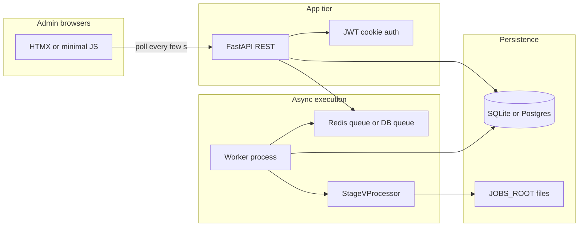

# Server web app: Test Bank parity + polling + auth

## Scope for “fast delivery”

**Phase 1 (ship first):** Replace the **Test Bank Generation** flow from [`main_gui.py`](main_gui.py) with a **server-first workflow** where **Step 1 and Step 2 are separate operations** (see next section). Auto-pair, prompts, providers/models per step, inter-pair delay, and continue-on-pair-failure should match [`main_gui.py`](main_gui.py) ~9395–9576 **except** the admin explicitly runs Step 2 after reviewing Step 1 outputs (optional **“Run full pair (Step1+Step2)”** can remain as a convenience that chains two queued jobs or calls existing `process_stage_v` once).

**Phase 2 (later):** Map other GUI tabs to the same job/artifact/polling pattern (or expose [`automated_pipeline_orchestrator.py`](automated_pipeline_orchestrator.py) `run_automated_pipeline`).

---

## Step 1 and Step 2 run separately (required)

Today [`stage_v_processor.py`](stage_v_processor.py) runs **`_step1_run_once`** then the Step 2 batched loop inside **`process_stage_v`** (~184–351). For the web app:

1. **Refactor** `StageVProcessor` to expose two public entry points that reuse internal helpers (no duplicate API logic):
   - **`process_stage_v_step1(...)`** — calls `_step1_run_once`, writes `step1_combined_{book}{chapter}.json` and related artifacts under the pair `output_dir`, returns path to the combined Step 1 JSON.
   - **`process_stage_v_step2(...)`** — takes `step1_combined_path` (and same Stage J / Word / prompts/models as today), runs the existing Step 2 batch (`_step2_refine_questions_and_add_qid` + merge + final `b*.json`), matching current combine/delete behavior in `process_stage_v`.

   **Persistence rule:** In **split** mode, **do not delete** `step1_combined_*.json` after Step 1; only delete it after Step 2 completes successfully (same as [`stage_v_processor.py`](stage_v_processor.py) ~344–348 today). If Step 2 has not run yet, the admin must still see and download the Step 1 artifact.

2. **Keep** **`process_stage_v`** as a thin wrapper that calls Step 1 then Step 2 (Tkinter GUI unchanged unless you later switch it to the split API).

3. **DB / pair state:** extend **`job_pairs`** with explicit flags, e.g. `step1_status` (`pending|running|succeeded|failed`), `step2_status` (same), and optional `step1_artifact_id` or path to the registered `step1_combined` file so Step 2 jobs validate prerequisites.

4. **API shape (conceptual):**
   - Create job with uploads + pairing → **enqueue Step 1 only** (per pair or batch), or **enqueue “full pair”** if you want one-click parity with the GUI.
   - **`POST .../pairs/{pair_id}/run-step1`** (or batch) → worker runs only Step 1.
   - **`POST .../pairs/{pair_id}/run-step2`** → allowed only when Step 1 succeeded; worker runs Step 2 and final merge.

5. **Artifacts:** after Step 1, register `step1_combined_*.json` (and any txt dumps); after Step 2, register per-topic Step 2 files and final `b*.json` — same as today, but **visible between steps** for admin review.

---

## Why polling (not SSE / WebSockets)

Your constraint fits **short-lived JSON polls**: each response is a normal HTTP request that completes even if the connection is slow. Implement:

- **`job_log_lines`** (or append-only `job_events`): `(job_id, seq, ts, line_text, pair_index nullable)` with monotonic `seq` per job.
- **`GET /api/jobs/{id}/poll?after_seq=N&limit=…`**: returns `{ job_status, pairs_snapshot[], log_lines[], max_seq, artifact_summaries[] }` — idempotent, cache-friendly, retry-safe.

**Worker writes logs to the DB** inside `progress_callback` (batched inserts every N ms or every K lines to avoid DB chatter). The UI uses **`setInterval`** (e.g. 2–4 s while `queued|running`, backoff when `succeeded|failed`) — no streaming connection required.

---

## Backend stack (pragmatic)

| Piece | Choice |
|-------|--------|
| API | **FastAPI** + Pydantic v2 |
| DB | **SQLAlchemy 2.x** + **Alembic**; **`DATABASE_URL`** switches **SQLite** (single-node MVP) vs **PostgreSQL** (production) |
| Auth | **bcrypt** hashes + **JWT in HttpOnly cookie** (or server sessions stored in DB); CSRF token for cookie-based form posts if you use cookie auth |
| Worker | **Separate process** (recommended): **RQ + Redis** *or* **Celery + Redis** — queue holds `job_id`; worker runs Stage V. Redis here is only for **job queue**, not for SSE. |
| Files | Large JSON **on disk** under `JOBS_ROOT/<job_id>/pair_<i>/...`; DB stores paths + metadata only |

**Simple alternative if you must avoid Redis entirely:** a **DB-backed queue** (`jobs.status = pending`, worker loop `SELECT … FOR UPDATE SKIP LOCKED`) — fewer moving parts, one downside: you must run exactly one worker or use proper locking (still fine for 3 admins).

---

## Frontend (“simple”)

Pick one:

1. **HTMX + Jinja2** — server-rendered pages; polling via `hx-get` + `hx-trigger="every 3s"` on the job detail fragment (fastest admin UI, minimal JS).
2. **Alpine.js + light HTML** (no full SPA) — one job page with `fetch()` polling.

Avoid heavy React unless you already depend on it; for **large JSON viewing**, load preview via API into a scrollable `<pre>` or a small **virtualized** JSON viewer script.

---

## Test Bank Generation UI (primary feature screen)

Ship a **dedicated section** in the admin app (e.g. nav **“Test Bank Generation”** → `/test-bank` or **New job → Test Bank**) that reproduces what [`setup_stage_v_ui`](main_gui.py) builds (~8683+) so operators do not rely on the desktop app for this flow.

### Layout (match Tkinter sections top to bottom)

| Tkinter area ([`main_gui.py`](main_gui.py)) | Web UI |
|---------------------------------------------|--------|
| Title + short description (“Generate test files from Tagged data…”) | Page heading + one-line help text |
| **Stage J JSON** — browse multiple, select folder, scrollable selected list | Multi-file input + optional **upload folder** (zip or repeated file picker); chips/list of selected filenames with remove |
| **Word files** — browse multiple, select folder, scrollable list | Same pattern for `.docx` / `.doc` |
| **Pairs** — “Auto-Pair” button, list Stage J ↔ Word per row | **Auto-Pair** runs client-side preview (same algorithm as server) or POST preview endpoint; table: Stage J name, Word name, optional **Change Word** (re-pick file for that row) |
| **Step 1** — default vs custom prompt, combobox of [`PromptManager`](prompt_manager.py) names (“Test Bank Generation - Step 1 Prompt”), large text area, **provider + model** (`add_stage_settings_section` for `stage_v_step1`) | Radio **Default / Custom**; `<select>` populated from server `GET /prompts/names` + default body text from `GET /prompts/{name}`; two text areas or one with tabs; Step 1 **provider** + **model** dropdowns (same options as GUI) |
| **Step 2** — same pattern for Step 2 prompt + `stage_v_step2` provider/model | Same as Step 1 for Step 2 |
| **Delay between batches** (seconds, default 5) | Number input |
| **Process All Pairs** | Replace with server actions: **Run Step 1 (all)** / **Run Step 2 (all ready)** / optional **Run full pipeline (Step1+Step2)** for parity with old one-click batch |
| Progress bar + status label | Job-level progress on redirect to **job detail**, or embedded progress via poll |
| **View CSV** (if present after success) | Link when CSV artifact exists (same condition as GUI) |

### Post-submit flow

After **Create job** (multipart submit), redirect to **job detail** where the **per-pair Step 1 / Step 2 checklist**, logs, and downloads live (see below). The Test Bank form can also link **“Continue existing job”** from the job list.

### i18n / RTL note

The GUI uses a Farsi-capable font for prompt textareas (`farsi_text_font`). On the web, use **`dir="auto"`** on prompt `<textarea>` elements and a Unicode-capable font stack so pasted Persian content matches desktop behavior.

---

## Admin UI — implement every screen (maps to delivery work)

Build the following **server-rendered** pages (or HTMX partials) so “implementation todos” become visible, testable UI:

| Screen | Purpose |
|--------|---------|
| **Login** | Email + password; sets auth cookie; redirect to job list |
| **Job list** | Table: id, created_at, status, pair counts, created_by; link to detail |
| **New Test Bank job** | Full **Test Bank Generation UI** (see section above): uploads, Auto-Pair table, Step 1/2 prompts (default/custom + prompt library), providers/models, delay; submit creates job + artifacts |
| **Job detail** | Header: job status, summary errors; **log panel** (poll); **per-pair card** with **step checklist**: Step 1 (status badge, “Run Step 1”, preview/download `step1_combined`) → Step 2 (status badge, “Run Step 2” enabled only when Step 1 succeeded, preview/download final `b*.json` and intermediates) |
| **Artifact preview** | Modal or inline: chunk preview (`offset`/`limit`) + **Download** button |

**Step checklist UX:** Use clear visual states (pending / running / success / failed) and disable Step 2 actions until Step 1 is green for that pair. Batch actions (“Run Step 1 for all pairs”, “Run Step 2 for all ready pairs”) are optional shortcuts on the job detail page.

This section is the **UI counterpart** to the implementation todo list: each row above should be testable in the browser before calling Phase 1 done.

### UI for the “todos” / checklist (implementation scope)

Implement **admin screens** that cover the same work areas as the plan todos, with a **visible step checklist** per job (not a separate project-management tool):

| Area | UI deliverable |
|------|----------------|
| Auth & users | Login / logout; optional “Account” line showing current admin |
| New Test Bank job | Form: multi upload Stage J + Word, prompts/models/providers, delay; **Auto-pair** preview table before submit; actions **Run Step 1 (all pairs)** or **Run full pair** if offered |
| Job list | Table: id, type, status, created_by, time; link to detail |
| Job detail | **Checklist / todos list** for each pair: **Step 1** (status chip, last log line, preview/download Step 1 combined JSON) → **Step 2** (enabled only when Step 1 ok; same for outputs); **Run Step 1** / **Run Step 2** buttons per pair or batch |
| Live progress | Side or bottom **log panel** fed by **`/poll`** (incremental lines) |
| Artifacts | List all files with role labels; preview (chunked) + download |
| Empty / error states | Clear copy when Step 2 blocked (Step 1 missing/failed) |

The **checklist** is the primary navigation for “what’s left” on a job: admins see at a glance which pairs need Step 2 or failed on Step 1.

---

## Parity with the GUI (must not drift)

**Extract pure helpers** (new module e.g. `stage_v_pairing.py` or `services/test_bank.py`) and call them from both GUI and API:

- **Word filename → book/chapter:** logic from [`main_gui.py`](main_gui.py) `_extract_book_chapter_from_word_filename_for_v` (lines ~9236–9257).
- **Stage J path → book/chapter:** from `_extract_book_chapter_from_stage_j` / PointId / `a{book}{chapter}.json` fallback (see ~9215–9234 region).
- **Auto-pair:** same loop as `_auto_pair_stage_v_files` (~9260+): for each Stage J, match first unused Word with same `(book_id, chapter_id)`.

**Worker calls** must match existing processor behavior; today the GUI uses monolithic `process_stage_v` ([`main_gui.py`](main_gui.py) ~9508–9521). On the server, call **`process_stage_v_step1`** / **`process_stage_v_step2`** (after refactor) with the same argument construction (providers, `stage_settings_manager`, `output_dir`, `progress_callback`).

**Output directory:** GUI uses [`get_default_output_dir`](main_gui.py) (~1085–1106). On the server, **pin output to** `JOBS_ROOT/<job_id>/pair_<n>/output` (predictable, isolated, backup-friendly).

---

## Data model (minimal)

- **`users`**: `id`, `email`, `password_hash`, `is_active`, `created_at`
- **`jobs`**: `id`, `type` (`test_bank`), `status`, `created_by_id`, `created_at`, `started_at`, `finished_at`, `error_summary`, optional `input_json` for prompts/models/delay snapshot
- **`job_pairs`**: `job_id`, `pair_index`, `stage_j_storage_name`, `word_storage_name`, **`step1_status`**, **`step2_status`**, `step1_error`, `step2_error`, `output_dir_rel` (pair-level `status` can mirror “overall” or be derived)
- **`artifacts`**: `id`, `job_id`, `pair_index`, `relative_path`, `role` (`upload_stage_j`, `upload_word`, `step1_combined`, `step2_topic`, `final_b_json`, `log_file`, …), `byte_size`, `sha256`, `created_at`
- **`job_log_lines`**: `job_id`, `seq`, `ts`, `line`, `pair_index` (nullable)

After each **phase** completes (Step 1 or Step 2), **scan the pair output directory** and upsert `artifacts` for every file (intermediate + final), mirroring the many files written by [`stage_v_processor.py`](stage_v_processor.py).

---

## API surface (Phase 1)

- **`POST /auth/login`**, **`POST /auth/logout`**, **`GET /auth/me`**
- **`GET /prompts/names`**, **`GET /prompts/{name}`** (optional) — back the Test Bank form’s default-prompt comboboxes with the same data as [`PromptManager`](prompt_manager.py) / `prompts.json` (or ship static list in v1)
- **`POST /jobs/test-bank`**: `multipart/form-data` — multiple `stage_j_files[]`, `word_files[]`, plus fields for `prompt_1`, `prompt_2`, `provider_1`, `model_1`, `provider_2`, `model_2`, `delay_seconds` (defaults aligned with GUI / [`PromptManager`](prompt_manager.py) where applicable). Creates job + pairs; does **not** have to auto-start processing (can return job id and let user click “Run Step 1”).
- **`POST /jobs/{id}/enqueue-step1`**, **`POST /jobs/{id}/enqueue-step2`** — body optional: `{ "pair_indices": [0,1] }` or omit for all applicable pairs; returns accepted + queue ids
- **`GET /jobs`**, **`GET /jobs/{id}`** — list pairs + `step1_status` / `step2_status` + artifact metadata
- **`GET /jobs/{id}/poll?after_seq=`** — incremental logs + status (core of “polling UX”)
- **`GET /artifacts/{id}/download`** — `FileResponse` with original filename
- **`GET /artifacts/{id}/preview?offset=&limit=`** — return **slice of bytes** (or decoded UTF-8-safe chunk) + `total_bytes`; never load multi‑MB JSON into one JSON response body

**Bootstrap 3 admins:** env like `ADMIN_BOOTSTRAP='[{"email":"...","password":"..."}, ...]'` or `ADMIN_EMAIL_1` / `ADMIN_PASSWORD_1` … applied once at startup/migration (hashed).

---

## Deployment (single server)

- **`docker-compose`**: `api` (uvicorn/gunicorn), `worker`, optional `redis` (if using RQ), optional `postgres`; **volume** `JOBS_ROOT`
- **Reverse proxy:** raise **`client_max_body_size`** for multi-file uploads; **timeouts** for long uploads (polling does not need special proxy streaming config)

---

## Testing checklist (Phase 1)

- Login as each of 3 admins; decide policy: **all admins see all jobs** (simplest for ops) vs owner-only.
- Multi-file upload + auto-pair matches GUI counts for the same filenames.
- **Run Step 1 only** → `step1_combined` artifact appears; Step 2 stays pending; preview/download works.
- **Run Step 2** after review → final `b*.json` appears; Step 1 combined file handled per cleanup rules.
- Poll endpoint returns increasing `seq`; per-pair step statuses update under polling.
- Download final `b*.json` and at least one intermediate file; preview returns first chunk without loading entire file into memory on the client.

---

## Realistic timeline

- **Phase 1** (auth + DB + worker + Test Bank + polling UI + artifacts + preview/download): **~3–6 focused days** for a developer familiar with this repo.
- **Phase 2** (full GUI parity): incremental, per-tab using the same pattern.

---

## Key files to reuse (do not reimplement Stage V)

- [`stage_v_processor.py`](stage_v_processor.py) — refactor: `process_stage_v` (wrapper), new **`process_stage_v_step1`**, **`process_stage_v_step2`**; reuse `_step1_run_once`, Step 2 batch + merge
- [`main_gui.py`](main_gui.py) — pairing + batch loop + API key validation pattern
- [`stage_settings_manager.py`](stage_settings_manager.py), [`unified_api_client.py`](unified_api_client.py) / [`api_layer.py`](api_layer.py) — construct API client like the GUI
