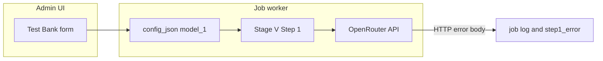

# Test Bank: GLM-5 default, Qwen optional, provider-first errors (web only)

## Current behavior (relevant pieces)

- **Job config**: [`webapp/main.py`](webapp/main.py) already persists `provider_1` and `model_1` from the Test Bank 1 form into `Job.config_json`.
- **Execution**: [`webapp/tasks_stage_v.py`](webapp/tasks_stage_v.py) reads `model_1` / `provider_1`, builds the Stage V processor, and calls `process_stage_v_step1(..., model_name_1=model_1, ...)`. Exceptions become `pair.step1_error` and log lines (`pair N: ERROR ...`), visible on the job page ([`webapp/templates/job_detail.html`](webapp/templates/job_detail.html) shows `step1_error`).
- **Stage V** does **not** bisect or shrink prompts on context errors; it **re-raises** [`OpenRouterAPIError`](openrouter_api_client.py) after logging (see `_step1_run_once` in [`stage_v_processor.py`](stage_v_processor.py)). Generic non-API exceptions still get up to **3 retries**, which is unrelated to context limits.
- **Where “handling” actually lives today**: [`openrouter_api_client.py`](openrouter_api_client.py) — `_build_openrouter_error_message`, `_likely_context_or_token_limit`, and similar branches **append long explanatory paragraphs** (token estimates, GLM ~202k hints, “shorten input” advice). That is app-side interpretation layered on top of OpenRouter’s JSON `error.message`.

## Design decisions

| Topic | Decision |
|-------|----------|
| **Desktop app** | **No changes** — do not edit [`main_gui.py`](main_gui.py) or other desktop-only code. Do **not** extend [`api_layer.py`](api_layer.py) `OPENROUTER_TEXT_MODELS` for this feature, because that list is consumed by the desktop model comboboxes and would change the desktop UI. |
| **Default model for Test Bank** | **Keep** [`webapp/config.py`](webapp/config.py) `DEFAULT_TEST_BANK_MODEL` = **`z-ai/glm-5`**. Form `value` / pre-filled model field stays GLM-5. |
| **Qwen and other 1M options** | **Selective only:** define a **webapp-only** curated list (e.g. `TEST_BANK_OPENROUTER_MODEL_CHOICES` in [`webapp/config.py`](webapp/config.py)) including at minimum **`qwen/qwen3.6-plus`** and optionally **`qwen/qwen3.6-plus-preview`**, plus the default GLM-5, for the **datalist** suggestions. Admins can still type any OpenRouter model id. |
| **Global `APIConfig.DEFAULT_OPENROUTER_MODEL`** | **Unchanged** (stays GLM-5 for shared code and env fallbacks). |
| **Admin UX** | **`<input list="...">` + `<datalist>`** on Test Bank 1/2; pass `test_bank_model_choices` + `default_test_bank_model` from [`webapp/main.py`](webapp/main.py). Help text: default is GLM-5; mention Qwen 3.6 Plus as an optional pick for large context. |
| **Provider field** | Unchanged (e.g. text default `openrouter`) or optional polish only in **web** templates — no new desktop impact. |

## Error messaging (provider-first)

In **[`openrouter_api_client.py`](openrouter_api_client.py)**:

- Change **`OpenRouterAPIError` message** (what `str(e)` / job logs show) to something minimal like:  
  `OpenRouter HTTP <status>: <provider_message>`  
  using `_parse_openrouter_error_body` / stream `error.message` as the source of truth.
- **Remove** (or gate behind a debug logger only, not the exception string) the extra blocks that call `_likely_context_or_token_limit` and append “This usually means…”, GLM context estimates, and “shorten input” paragraphs — both for **non-stream** (`_call_chat_completions`) and **stream** (`_stream_chat_completions`) paths.
- Optionally keep **one short diagnostic line** in **worker logs only** (not in `OpenRouterAPIError`): `model=… max_tokens=…` — avoids pretending to “fix” context while preserving ops debugging. If you want **zero** app commentary, omit that line too and rely on structured logging elsewhere.

**Scope note:** Other packages ([`stage_j_processor.py`](stage_j_processor.py), [`stage_e_processor.py`](stage_e_processor.py), etc.) implement **bisect/taper** recovery for web Stage J — that is separate from Test Bank. This plan **does not** remove those flows unless you explicitly want to strip context handling **globally** (large behavior change).

## Files to touch

1. [`webapp/config.py`](webapp/config.py) — add `TEST_BANK_OPENROUTER_MODEL_CHOICES` (or similar) with `z-ai/glm-5` + `qwen/qwen3.6-plus` (+ optional preview). **Keep** `DEFAULT_TEST_BANK_MODEL = "z-ai/glm-5"`.
2. **Do not** change [`api_layer.py`](api_layer.py) for model lists (desktop stays as-is).
3. [`webapp/main.py`](webapp/main.py) — pass `test_bank_model_choices` and `default_test_bank_model` into `test_bank_1_new` / `test_bank_2_new` template context.
4. [`webapp/templates/test_bank_1_new.html`](webapp/templates/test_bank_1_new.html), [`webapp/templates/test_bank_2_new.html`](webapp/templates/test_bank_2_new.html) — datalist-backed model input; copy reflects GLM-5 default and Qwen as optional.
5. [`openrouter_api_client.py`](openrouter_api_client.py) — slim exception messages; stop appending heuristic context-window essays.

## Verification

- Create a Test Bank 1 job without changing the form: submitted `model_1` should remain **`z-ai/glm-5`**.
- Choose Qwen from the datalist: submitted `model_1` should be **`qwen/qwen3.6-plus`**.
- Force an oversized/failing request (or invalid key): job log / `step1_error` should show **OpenRouter’s message** without long appended remediation text.
- Confirm Step 1 still fails fast on `OpenRouterAPIError` (no silent swallowing).

