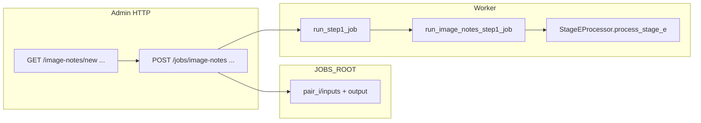

# Three single-stage admin job pages (E, TA, F)

## Current state (from codebase)

- **Labels only:** [`webapp/main.py`](webapp/main.py) `JOB_STAGE_LABELS` already maps `image_notes` / `stage_e`, `table_notes` / `stage_ta`, `image_file_catalog` / `stage_f` to human names. No routes or workers exist for them yet.
- **Worker gap:** [`webapp/tasks_stage_v.py`](webapp/tasks_stage_v.py) `run_step1_job` only delegates to [`webapp/tasks_single_stage.py`](webapp/tasks_single_stage.py) for `pre_ocr_topic`, `ocr_extraction`, `document_processing`. New job types would incorrectly fall through to Test Bank Step 1 unless dispatch is added.
- **Single-stage set:** [`webapp/job_runner_common.py`](webapp/job_runner_common.py) `SINGLE_STAGE_JOB_TYPES` must include the three new `Job.type` strings so list status, inbox copy ([`webapp/inbox.py`](webapp/inbox.py)), and artifact splitting behave like existing single-stage jobs.
- **Processors (ground truth for inputs):**
  - **Stage E** — [`stage_e_processor.py`](stage_e_processor.py) `process_stage_e(stage4_path, ocr_extraction_json_path, prompt, model_name, output_dir=...)`.
  - **Stage TA** — [`stage_ta_processor.py`](stage_ta_processor.py) `process_stage_ta(stage_e_path, ocr_extraction_json_path, prompt, model_name, output_dir=...)`.
  - **Stage F** — [`stage_f_processor.py`](stage_f_processor.py) `process_stage_f(stage_e_path, output_dir=...)` (deterministic catalog JSON from Stage E; reads optional `*_filepic.json` **next to** the Stage E file when present — see same-dir lookup in that file).

## Canonical `Job.type` values

Use **`image_notes`**, **`table_notes`**, **`image_file_catalog`** (aliases `stage_*` remain labels-only unless you also add duplicate POST handlers—prefer one canonical string per job).

## URL and form pattern (match project, not `/jobs/new/...`)

Follow existing convention:

| Flow | GET (form) | POST (create) |
|------|------------|----------------|
| Image notes | `/image-notes/new` | `/jobs/image-notes` |
| Table notes | `/table-notes/new` | `/jobs/table-notes` |
| Image file catalog | `/image-file-catalog/new` | `/jobs/image-file-catalog` |

Same structure as [`ocr_extraction_new.html`](webapp/templates/ocr_extraction_new.html) (`action="/jobs/ocr-extraction"`).

## JobPair / filesystem mapping

Reuse **`JobPair.stage_j_relpath`** and **`word_relpath`** as today (no schema migration):

| Job type | `stage_j_relpath` | `word_relpath` | Notes |
|----------|-------------------|----------------|--------|
| `image_notes` | Stage 4 JSON (lesson JSON with PointId) | OCR extraction JSON | Pair **i-th** sorted file from each upload list (same rule as OCR extraction). |
| `table_notes` | Stage E JSON (`e*.json`) | OCR extraction JSON | Same index pairing after sort. |
| `image_file_catalog` | Stage E JSON | Optional **filepic** JSON (`*_filepic.json`) | If optional uploads provided, counts must match Stage E files; copy filepic into `pair_i/inputs/` with original basename so [`stage_f_processor.py`](stage_f_processor.py) can resolve `{base}_filepic.json` beside the Stage E file. |

**Artifact roles** (input registration): keep names explicit in POST handlers, e.g. `upload_stage4_json`, `upload_stage_e_json`, `upload_ocr_json`, `upload_filepic_json` (short comments where pairing is index-based).

## Worker implementation (`tasks_single_stage.py`)

Add three functions modeled on [`run_document_processing_step1_job`](webapp/tasks_single_stage.py) / [`run_ocr_extraction_step1_job`](webapp/tasks_single_stage.py):

- Load config from `job.config_json`: `prompt`, `model` (and optionally `provider` if you thread it—today [`build_unified_api_client`](webapp/processor_context.py) is used without per-job provider in single-stage runners; **match existing pattern**: store `model`, default prompt via new getters).
- For each pair: resolve absolute paths from `job_root`, call `StageEProcessor` / `StageTAProcessor` / `StageFProcessor` from [`processor_context`](webapp/processor_context.py) (same as other runners).
- On success: `register_artifacts_under(db, job_id, pair_index, base, rel_out_dir)` for the pair’s `output/` directory (same as OCR extraction).
- Cancel / delay / failure handling: copy the same structure as `run_ocr_extraction_step1_job`.

## Dispatch (`tasks_stage_v.py`)

At the top of `run_step1_job`, after the existing three `if jt == ...` branches, add three more that import and call the new runners (same pattern as `pre_ocr_topic`).

## HTTP layer (`webapp/main.py`)

- **GET** handlers for the three `/…/new` routes (pass `multipart_ok`, default prompts).
- **POST** handlers (inside `if HAS_MULTIPART:`) mirroring [`create_ocr_extraction_job`](webapp/main.py) / [`create_document_processing_job`](webapp/main.py): validate job name, sort paths with `_sorted_nonempty_paths`, enforce equal counts where two lists are required, write under `job_root`, create `Job` + `JobPair` rows, `register_input_artifact`, `commit`, redirect to `/jobs/{id}`.
- **Else** branch: add three stub POSTs like [`create_document_processing_job_stub`](webapp/main.py).

## Defaults (`webapp/default_prompts.py`)

- **`get_default_image_notes_prompt()`** — read key **`Image Notes Prompt`** from [`prompts.json`](prompts.json) (already present).
- **`get_default_table_notes_prompt()`** — read **`Table Notes Prompt`**. The desktop GUI expects this name ([`main_gui.py`](main_gui.py) ~4903), but the key may be **missing** from `prompts.json` today. **Minimal fix:** implement getter with `.get("Table Notes Prompt")` and fallback to **`Image Notes Prompt`** (with a one-line comment that a dedicated table prompt can be added to `prompts.json` later—avoids duplicating large strings in code).

## Templates

Add three files under [`webapp/templates/`](webapp/templates/), cloning structure/CSS from [`ocr_extraction_new.html`](webapp/templates/ocr_extraction_new.html) / [`document_processing_new.html`](webapp/templates/document_processing_new.html):

- **`image_notes_new.html`** — explain pairing: same count of **Stage 4 JSON** + **OCR extraction JSON**; order = sort by filename within each group (same helper text style as OCR page).
- **`table_notes_new.html`** — **Stage E JSON** + **OCR extraction JSON**; same pairing rule.
- **`image_file_catalog_new.html`** — **Stage E JSON** required; optional **filepic JSON** multi-upload; helper text that this step **generates** the catalog JSON (`f_*.json`) from Stage E (and filepic when supplied), not merely listing files.

## Job detail UI ([`webapp/templates/job_detail.html`](webapp/templates/job_detail.html))

Extend every `job.type` branch used for single-stage jobs:

- **Inputs** table: columns for the three types (e.g. Stage 4 + OCR; Stage E + OCR; Stage E + optional filepic).
- **Run** section headings and button labels (today `Run document processing`) — add clauses for `image_notes`, `table_notes`, `image_file_catalog` so the primary button text is accurate (still one “step” in the DB).

No change to Step 2 UI beyond what `single_stage_job` already hides.

## Navigation

- [`webapp/templates/base.html`](webapp/templates/base.html) sidebar: add three links under Document Processing (same pattern as Pre-OCR / OCR).
- [`webapp/templates/jobs_list.html`](webapp/templates/jobs_list.html): optionally extend the empty-state line to mention one of the new flows (minimal—single extra sentence or link list is enough).

## Auth

Same as existing job pages: handlers take **`CurrentUser`** from [`webapp/deps`](webapp/deps.py) (already required for `/ocr-extraction/new`).

## Testing / verification

- After implementation: create a draft job per type with tiny fixture JSONs (or invalid early failure) and confirm redirect, job row `stage_label`, and that **Run** triggers the correct code path (worker logs / pair status).

