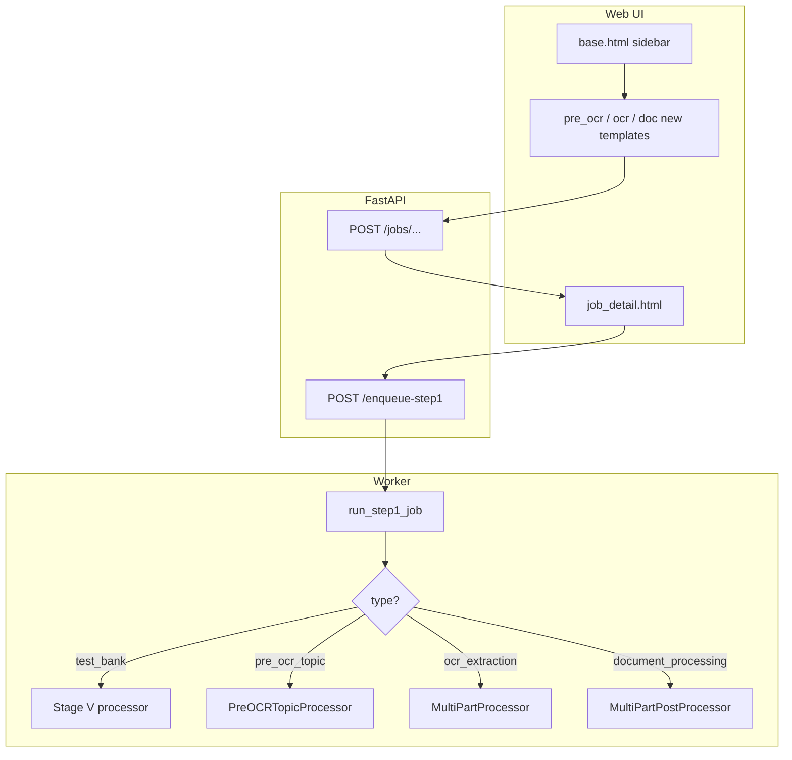

# Web pages for Pre-OCR, OCR Extraction, and Document Processing

## Context (current behavior)

- **Routing/UI**: [`webapp/main.py`](webapp/main.py) exposes `GET /test-bank/new` + `POST /jobs/test-bank` (multipart) which creates a `Job` with `type="test_bank"`, builds `JobPair` rows, copies files under `JOBS_ROOT`, redirects to `/jobs/{id}`. Sidebar links live in [`webapp/templates/base.html`](webapp/templates/base.html) (only **Jobs** + **New Test Bank** today).
- **Worker gap**: [`webapp/tasks_stage_v.py`](webapp/tasks_stage_v.py) implements `run_step1_job` / `run_step2_job` / `run_full_pipeline_job` for **Stage V only** (via `build_stage_v_processor()`). It does **not** branch on `job.type`, so any new `Job.type` would still execute Test Bank logic if enqueued today — this must be fixed for stable behavior.
- **Job detail UX**: [`webapp/templates/job_detail.html`](webapp/templates/job_detail.html) assumes Test Bank pairing (Stage J + Word) and a two-step pipeline. [`webapp/main.py`](webapp/main.py) sets `step2_enabled = job.type != "test_bank" or all_pairs_step1_succeeded(pairs)` — non–Test Bank jobs currently enable Step 2 without Step 1, and show **Run full pipeline** for `job.type != 'test_bank'`. New types need explicit rules so the UI stays honest (single-stage vs true two-step).

## Canonical `Job.type` values (align with `UnifiedAPIClient.set_stage`)

| Job type string | Sidebar / label | Desktop analogue |
|-----------------|-----------------|------------------|
| `pre_ocr_topic` | Pre-OCR Topic Extraction | `PreOCRTopicProcessor` / stage `pre_ocr_topic` |
| `ocr_extraction` | OCR Extraction | `MultiPartProcessor.process_ocr_extraction_with_topics` / stage `ocr_extraction` |
| `document_processing` | Document Processing | `MultiPartPostProcessor.process_document_processing_from_ocr_json` / stage `document_processing` |

Extend [`JOB_STAGE_LABELS`](webapp/main.py) with entries for `pre_ocr_topic` and `ocr_extraction` (document_processing is already present).

## 1) Sidebar + “new job” pages (Jinja)

Update [`webapp/templates/base.html`](webapp/templates/base.html) **Workspace** nav (same pattern as Test Bank):

- **New Pre-OCR** → `GET /pre-ocr/new`, active when path starts with `/pre-ocr`
- **New OCR Extraction** → `GET /ocr-extraction/new`
- **New Document Processing** → `GET /document-processing/new`

Add three templates alongside [`webapp/templates/test_bank_new.html`](webapp/templates/test_bank_new.html):

- **`pre_ocr_new.html`**: `multipart_ok` banner (reuse pattern), required **job name**, multiple **PDF** uploads, prompt textarea (default from prompts — see §4), provider/model fields (defaults aligned with desktop: Google / `gemini-2.5-pro`), delay seconds — `POST` to `/jobs/pre-ocr`.
- **`ocr_extraction_new.html`**: job name, multiple **PDF** + multiple **Pre-OCR topic JSON** (`t*.json`) uploads, prompt default **`prompts.json` → `"OCR Extraction Prompt"`**, provider/model, delay — `POST` `/jobs/ocr-extraction`. **Pairing rule (simple, stable)**: require equal file counts; pair **i-th PDF** with **i-th JSON** after a deterministic sort by basename (document in UI copy). Reject with 400 if counts differ.
- **`document_processing_new.html`**: job name, multiple **OCR Extraction JSON** uploads, prompt default **`Document Processing Prompt`**, provider/model, delay, optional **PointId mapping .txt** upload (stored once under job root and path recorded in `config_json`, matching desktop behavior). **Phase 1 minimal**: omit manual start-PointId UI unless you want parity — optional fields increase form complexity; note as follow-up if omitted.

Each POST handler mirrors `create_test_bank_job`: temp dir → validate → `uuid` job id → `job_root` → `Job` + `JobPair` rows + `register_input_artifact` with roles such as `upload_pdf`, `upload_topic_json`, `upload_ocr_json`, `upload_pointid_txt` (pick consistent role names and reuse **Inputs & other** section on detail page).

## 2) FastAPI routes ([`webapp/main.py`](webapp/main.py))

- Three `GET` routes rendering the new templates (pass defaults + `multipart_ok` like Test Bank).
- Three `POST` routes under `/jobs/...` (guard with `HAS_MULTIPART` like Test Bank), creating jobs with the correct `Job.type` and `config_json` (`display_name`, prompts, providers, models, `delay_seconds`, optional pointid path).
- **`job_detail`**: pass flags such as `single_stage_job` or `job_family` so templates can adjust copy — e.g. `single_stage_types = frozenset({"pre_ocr_topic", "ocr_extraction", "document_processing"})` and pass `hide_step2`, `hide_word_pairing`, `rename_columns` (or pass explicit strings for column titles).

## 3) Job detail template adjustments ([`webapp/templates/job_detail.html`](webapp/templates/job_detail.html))

For the three types (via passed flags):

- **Word pairing** card: hide or relabel — Pre-OCR needs no second file; OCR Extraction files are fixed at create time (pairing could be read-only list); Document Processing may only need optional PointId file (already in config). Simplest stable approach: **hide the pairing form** for these types and show a read-only table of inputs (filenames from `JobPair` + artifacts).
- **Step 2** card: **hide** for single-stage types so users are not offered a no-op Step 2.
- **Run full pipeline** block: **hide** for these types (today it shows for all non–test_bank).
- **Step 1** card: adjust title/description text per type (e.g. “Run Pre-OCR” vs “Run OCR Extraction”) via `job.type` conditionals — keep one primary run button wired to the same `/enqueue-step1` endpoint.

## 4) Defaults ([`webapp/default_prompts.py`](webapp/default_prompts.py))

Add small getters that read `prompts.json` keys already present:

- `"Pre OCR Topic"`
- `"OCR Extraction Prompt"`
- `"Document Processing Prompt"`

(Keep existing Test Bank helpers unchanged.)

## 5) Worker dispatch ([`webapp/tasks_stage_v.py`](webapp/tasks_stage_v.py) — or split into `webapp/tasks_dispatch.py`)

**Required for correctness:**

- At the start of `run_step1_job`, load `job.type` and **dispatch**:

  - **`pre_ocr_topic`**: For each pair, primary PDF path = `stage_j_relpath` (or dedicated artifact role — stay consistent with create handler). Build `PreOCRTopicProcessor(UnifiedAPIClient)` pattern like [`main_gui.py`](main_gui.py) (`set_stage("pre_ocr_topic")`), call `process_pre_ocr_topic`, write outputs under `pair_output`, `register_artifacts_under`. Skip pairs missing PDF.

  - **`ocr_extraction`**: PDF + topic JSON paths per pair (`word_relpath` stores topic JSON). Build `MultiPartProcessor(client)`, `set_stage("ocr_extraction")`, call `process_ocr_extraction_with_topics`, register outputs.

  - **`document_processing`**: One OCR JSON per pair (primary path). Build `MultiPartPostProcessor(client)`, `set_stage("document_processing")`, call `process_document_processing_from_ocr_json` with prompt/model from `config_json` and optional `pointid_mapping_txt` path from config. Mirror GUI defaults for `start_point_index` / book-chapter when mapping file absent (same as desktop or conservative defaults).

- Shared infrastructure: add **`build_unified_api_client()`** (or refactor [`webapp/processor_context.py`](webapp/processor_context.py)) returning `(UnifiedAPIClient, StageSettingsManager)` without forcing `StageVProcessor`, so workers do not import Stage V for non-V jobs.

- **`run_step2_job`**: If `job.type` is one of the three single-stage types, **no-op** (log + return) or **do not enqueue** from UI — UI hide is preferred; guard API anyway so POST Step 2 returns 400 with a clear message.

- **`run_full_pipeline_job`**: For single-stage types, run **only** the Step 1 dispatcher (or delegate to same function) so “full” is not accidentally Step1+TestBank Step2.

**Inbox notifications**: Reuse existing `notify_step1_finished` / `notify_job_crash` patterns where applicable so behavior matches Test Bank.

## 6) Celery ([`webapp/celery_tasks.py`](webapp/celery_tasks.py))

No structural change — tasks already call `run_step1_job`; dispatch lives inside that function.

## 7) Testing checklist (manual)

- Create each job type from new page → lands on detail → **Run Step 1** → log streams via `/jobs/{id}/poll`, artifacts downloadable.
- Confirm a **Test Bank** job still runs unchanged (regression).
- Confirm Step 2 / full pipeline hidden or disabled for new types.

## Architecture sketch

## Risk / scope note

Document Processing in the desktop app has **optional PointId mapping** and other knobs; the web form can stay minimal (JSON files + prompt + model + optional mapping file) to satisfy “simple and stable,” and add more fields later if needed.
