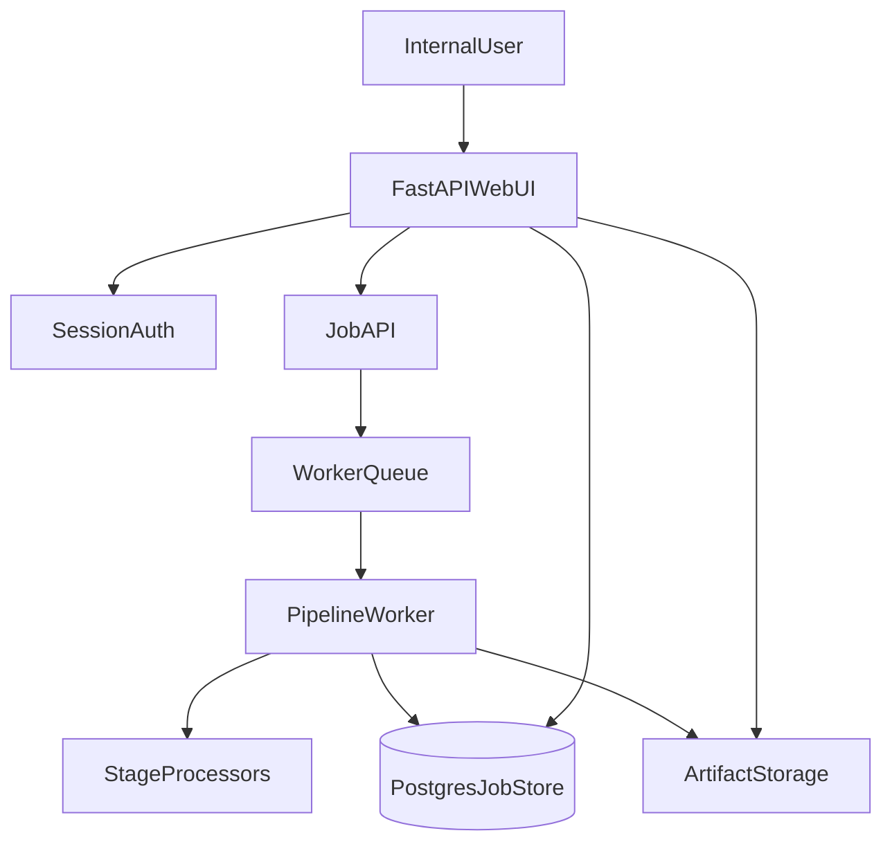

# FastAPI Web Migration Plan

## Goals
- Replace the desktop Tkinter interface with a web UI while preserving your existing pipeline logic.
- Host the app on a server for a small internal team with login, job tracking, and stable background processing.
- Secure secrets and data handling before production rollout.

## Current System Reuse Strategy
- Keep core pipeline/business logic and wrap it in web services:
  - [`/Users/mehrad/MyData/Code/Automations_Project_Pileh/content_automation_project/automated_pipeline_orchestrator.py`](/Users/mehrad/MyData/Code/Automations_Project_Pileh/content_automation_project/automated_pipeline_orchestrator.py)
  - [`/Users/mehrad/MyData/Code/Automations_Project_Pileh/content_automation_project/stage_v_processor.py`](/Users/mehrad/MyData/Code/Automations_Project_Pileh/content_automation_project/stage_v_processor.py)
  - [`/Users/mehrad/MyData/Code/Automations_Project_Pileh/content_automation_project/stage_e_processor.py`](/Users/mehrad/MyData/Code/Automations_Project_Pileh/content_automation_project/stage_e_processor.py)
  - [`/Users/mehrad/MyData/Code/Automations_Project_Pileh/content_automation_project/stage_f_processor.py`](/Users/mehrad/MyData/Code/Automations_Project_Pileh/content_automation_project/stage_f_processor.py)
  - [`/Users/mehrad/MyData/Code/Automations_Project_Pileh/content_automation_project/stage_j_processor.py`](/Users/mehrad/MyData/Code/Automations_Project_Pileh/content_automation_project/stage_j_processor.py)
- Replace GUI-specific flow in:
  - [`/Users/mehrad/MyData/Code/Automations_Project_Pileh/content_automation_project/main_gui.py`](/Users/mehrad/MyData/Code/Automations_Project_Pileh/content_automation_project/main_gui.py)
- Preserve API abstraction in:
  - [`/Users/mehrad/MyData/Code/Automations_Project_Pileh/content_automation_project/unified_api_client.py`](/Users/mehrad/MyData/Code/Automations_Project_Pileh/content_automation_project/unified_api_client.py)

## Target Architecture

## Phase 0 - Security and Readiness (Must do first)
- Revoke/rotate any exposed API keys and remove secrets from tracked files.
- Enforce `.env`-only secrets and safe defaults for committed config templates.
- Update ignore rules and CI checks to block future secret commits.
- Define production configuration contract (required env vars, optional vars, defaults).

## Phase 1 - Service Skeleton and Project Structure
- Add FastAPI app entrypoint (`app/main.py`) with:
  - health/readiness endpoints,
  - login/logout routes,
  - template routes (dashboard, job list, job detail, settings).
- Create service layer wrappers around existing processors so web routes never call GUI code.
- Add standardized settings module (Pydantic settings) and central logging config.
- Keep current Tkinter launcher available during transition (parallel run mode).

## Phase 2 - Job Model and Persistence
- Introduce PostgreSQL for server-safe multi-user operations:
  - tables for users, jobs, job_events, job_artifacts, stage_status.
- Replace ad-hoc local status tracking with DB-backed job lifecycle:
  - `queued -> running -> succeeded/failed/cancelled`.
- Keep heavy output files as artifacts on disk/object storage, but index metadata in DB.
- Add per-job isolated working directories to prevent cross-user file collisions.

## Phase 3 - Background Execution
- Move long pipeline tasks out of request/response cycle:
  - use Celery (or RQ) workers.
- Expose API endpoints:
  - create job,
  - check status,
  - stream/fetch logs,
  - list/download outputs.
- Map existing thread-based Tkinter callbacks to queue tasks.
- Preserve stage-level retries and batch behavior (especially Stage V concurrency) in worker code.

## Phase 4 - Web UI (Server-rendered templates)
- Build initial pages with Jinja2 + HTMX for low-friction dynamic UX:
  - login,
  - new job form,
  - active jobs dashboard,
  - job detail with live progress,
  - artifact download page,
  - stage settings page (admin-only).
- Recreate core controls now in Tkinter (stage selection, prompts, model settings, input files).
- Add polling/partial-refresh for progress updates instead of websocket-first complexity.

## Phase 5 - Pipeline Integration Refactor
- Extract GUI-independent orchestration contract:
  - input DTOs,
  - output DTOs,
  - error classes.
- Ensure orchestrator and stage processors can run headlessly from worker context.
- Normalize file path handling for server paths and user uploads.
- Add cancellation checkpoints between major stage boundaries.

## Phase 6 - Deployment and Ops
- Add production assets:
  - `Dockerfile` (web),
  - `Dockerfile` (worker),
  - `docker-compose.yml` (app + worker + db + redis),
  - `.env.example` update for server vars.
- Deploy with reverse proxy (Nginx/Caddy) and TLS.
- Add process supervision, structured logs, and log retention.
- Add backup policy for DB + artifacts.

## Phase 7 - Testing and Rollout
- Unit tests for service wrappers and job state transitions.
- Integration tests for API endpoints and worker tasks.
- Smoke test real document flow in staging server.
- Pilot with 1-2 internal users, then full team rollout.
- Keep Tkinter fallback for one short transition window, then deprecate.

## API/Route Blueprint (Initial)
- `POST /auth/login`
- `POST /auth/logout`
- `GET /dashboard`
- `POST /jobs`
- `GET /jobs`
- `GET /jobs/{job_id}`
- `POST /jobs/{job_id}/cancel`
- `GET /jobs/{job_id}/artifacts`
- `GET /health`

## Data and Storage Decisions
- Use Postgres for job/user/state metadata.
- Use Redis as worker broker/result backend.
- Use isolated artifact directories per job (`/data/jobs/<job_id>/...`) or S3-compatible object storage later.

## Milestone Delivery Plan
- Milestone 1 (Week 1): secure secrets + FastAPI skeleton + auth + health endpoint.
- Milestone 2 (Week 2): job submission, queue worker, status tracking, basic dashboard.
- Milestone 3 (Week 3): full Stage E/F/J/V flows via worker + artifact management.
- Milestone 4 (Week 4): deployment hardening, tests, staging pilot, internal go-live.

## Acceptance Criteria
- Internal users can authenticate and run jobs from browser.
- No pipeline work runs in web request threads.
- Job progress and outputs are visible/downloadable from UI.
- Secrets are not present in repo or logs.
- System survives concurrent team usage without file collision or state corruption.