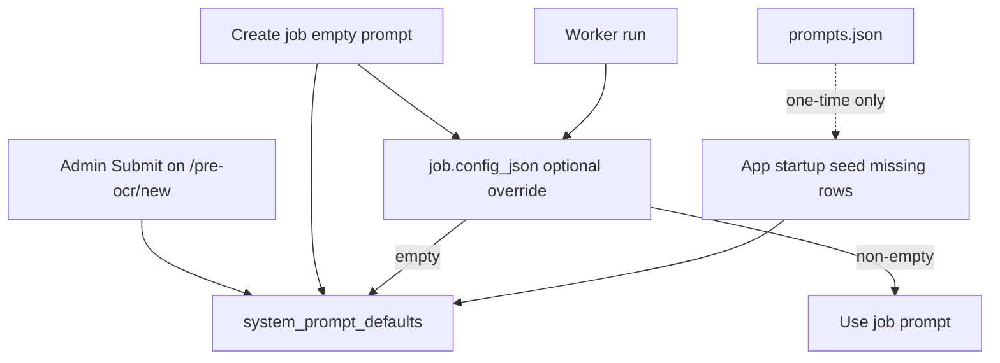

# Admin prompt defaults per job type (DB is source of truth)

## What you asked for

- **English** communication.
- **No** single page for all prompts.
- **Admin** changes the prompt on a job type’s **new job** page → **Submit** → **all future jobs of that type** use it.
- **Same job type only** (no pipeline cascade).
- **No runtime fallback** to `prompts.json` — the **database** is always what the web app and workers use after seed.
- **Simple architecture** and **readable code** (see [Code quality](#code-quality) and [Short implementation plan](#short-implementation-plan-before-coding)).

## Code quality

Apply these while building (your list, in English):

| Principle | Practice in this feature |
|-----------|---------------------------|
| **Small, single-purpose functions** | One module [`system_prompt_defaults.py`](webapp/system_prompt_defaults.py) owns DB access; each function does one thing (`seed_*`, `get_*`, `set_*`, `resolve_*`). No 200-line “god” helpers. |
| **Clear naming** | Names describe intent: `get_system_prompt_default`, `resolve_prompt_for_job`, `seed_system_prompt_defaults`, `require_admin`, `PromptNotConfiguredError`. Avoid abbreviations like `gspd`, `res`. |
| **No unnecessary shortcuts** | No clever one-liners, no nested ternaries, no `getattr` chains for prompt keys. Use explicit `if` and early returns. |
| **No dense, hard-to-read code** | Prefer straight-line flow over compression. Split worker changes into a single shared call instead of copy-pasting 10 similar blocks. |
| **Comments only for non-obvious logic** | Comment *why* seed runs once at startup, *why* desktop still uses file — not what `db.commit()` does. No docstrings on every obvious getter. |

**Architecture keep-it-simple:**

- **One table**, **one module** for prompt defaults, **one resolver** used everywhere (`resolve_prompt_for_job`).
- **Do not** add abstractions (registry classes, plugin loaders, generic “PromptProvider” interfaces) unless a second source appears later.
- **Admin check** stays a plain function in [`deps.py`](webapp/deps.py), not a middleware framework.
- **Templates** only gain a second button (`Submit`); no new JS framework.

## Short implementation plan (before coding)

Execute in this order so each step is testable and the codebase stays easy to follow:

1. **Model + migration** — `SystemPromptDefault` in [`models.py`](webapp/models.py); `CREATE TABLE IF NOT EXISTS` in [`schema_migrate.py`](webapp/schema_migrate.py).
2. **Core module** — [`system_prompt_defaults.py`](webapp/system_prompt_defaults.py): mapping constant, `seed_system_prompt_defaults`, `get_system_prompt_default`, `set_system_prompt_default`, `resolve_prompt_for_job`, `PromptNotConfiguredError`.
3. **Startup** — Call seed from app startup in [`main.py`](webapp/main.py) (after `create_all` / migrate / admin bootstrap).
4. **Admin auth** — `is_admin_user` + `require_admin` in [`deps.py`](webapp/deps.py).
5. **HTTP** — `POST /admin/prompt-defaults/{job_type}`; switch GET/POST create-job routes to `resolve_prompt_for_job` / `get_system_prompt_default`.
6. **Job UI data** — `build_prompt_editor_rows(db, ...)` in [`job_prompts.py`](webapp/job_prompts.py); pass `is_admin` into `*/new` templates.
7. **Workers** — One helper used from [`tasks_single_stage.py`](webapp/tasks_single_stage.py) and [`tasks_stage_v.py`](webapp/tasks_stage_v.py) instead of ten inline `get_default_*` blocks.
8. **Templates** — Admin Submit + copy updates on 10 `*_new.html` and [`job_detail.html`](webapp/templates/job_detail.html).
9. **Smoke check** — Seed row count, admin save, create job, worker reads DB (verification list below).

## Source of truth

| Layer | Role |
|-------|------|
| **`system_prompt_defaults` (DB)** | **Only** runtime source for web jobs and workers |
| [`prompts.json`](prompts.json) | **Seed only** — imported once when a `(job_type, config_key)` row is missing (deploy / first boot). Not read during normal job runs after seed. |
| **`job.config_json`** | Per-job override only; if empty at run time, worker loads from **DB** for that `job.type` |

## What we are not building

- Runtime chain `DB → prompts.json` (removed).
- One combined admin prompts page.
- Per-user overrides.
- Clearing admin prompt to “fall back” to file (empty Submit → **400**; no silent file fallback).
- Heavy patterns (generic providers, event buses, extra layers).

## Problem today

- Workers and UI call `get_default_*()` → read **file** when `config_json` is empty ([`webapp/tasks_single_stage.py`](webapp/tasks_single_stage.py), [`webapp/tasks_stage_v.py`](webapp/tasks_stage_v.py)).
- Admin edits on `*/new` do not persist globally.
- Job detail text says “fall back to `prompts.json`” — misleading once DB is canonical.

## Target behavior

1. **Startup / migration:** `seed_system_prompt_defaults(db)` — for every `(job_type, config_key)` in [`job_prompts._PROMPT_KEYS`](webapp/job_prompts.py), if no DB row exists, insert text from `prompts.json` via mapping in [`default_prompts.py`](webapp/default_prompts.py). Call from [`main.py`](webapp/main.py) lifespan after `create_all` + schema migrate (same place as `bootstrap_admins`).
2. **Admin Submit** on `/{stage}/new` → upsert DB row(s) for that `job_type`.
3. **Create job:** `prompt_eff = form.strip() or get_system_prompt_default(db, job_type, key)` — row must exist after seed; if missing, fail loudly (log + 500) rather than reading file.
4. **Workers:** call `resolve_prompt_for_job` with a short-lived `SessionLocal()` (same pattern as cancel checks).
5. **Job detail:** Submit updates **this job’s** `config_json` only. Copy: empty job prompt uses **system default from database**.
6. **Non-admin** on `*/new`: read-only DB prompt + note that only admins can change the system default.

## Data model

Table `system_prompt_defaults` in [`webapp/models.py`](webapp/models.py):

| Column | Type |
|--------|------|
| `job_type` | `String(32)`, PK |
| `config_key` | `String(32)`, PK |
| `prompt_text` | `Text`, NOT NULL |
| `updated_at` | `DateTime` |
| `updated_by_id` | `Integer` FK `users.id`, nullable |

`CREATE TABLE IF NOT EXISTS` in [`webapp/schema_migrate.py`](webapp/schema_migrate.py).

## Module [`webapp/system_prompt_defaults.py`](webapp/system_prompt_defaults.py)

Functions (each file section stays short):

- `PROMPTS_JSON_KEY_BY_JOB` — map `(job_type, config_key)` → `prompts.json` key (seed only).
- `seed_system_prompt_defaults(db) -> int` — insert missing rows from file.
- `get_system_prompt_default(db, job_type, key) -> str` — raises `PromptNotConfiguredError` if missing.
- `set_system_prompt_default(db, job_type, key, text, admin_user_id)` — upsert; reject empty `text`.
- `resolve_prompt_for_job(db, job_type, cfg, key) -> str` — job override, else DB.

Optional small worker helper in same file:

- `resolve_prompt_for_job_id(job_id, key) -> str` — opens session, loads job + cfg, calls `resolve_prompt_for_job` (avoids duplicating session boilerplate in every task).

[`webapp/job_prompts.py`](webapp/job_prompts.py): `build_prompt_editor_rows(db, job_type, cfg)` uses resolver; drop file reads from web display path.

[`webapp/default_prompts.py`](webapp/default_prompts.py): `get_default_*` **seed + desktop only** (module comment at top).

## Workers

Replace per-stage `get_default_*` blocks with one call to `resolve_prompt_for_job` (or `resolve_prompt_for_job_id`).

## Admin API ([`webapp/main.py`](webapp/main.py))

- `require_admin` on **`POST /admin/prompt-defaults/{job_type}`** — reject empty body.
- GET `*/new`: `default_prompt*` from DB; `is_admin` for template.
- POST `create_*_job`: `resolve_prompt_for_job` when form empty.
- Do **not** wire global save into `post_job_prompts`.

## UI

- 10 `*_new.html`: admin **Submit** (`formaction` + `formnovalidate`) + **Create job**.
- Remove placeholders mentioning `prompts.json`.
- [`job_detail.html`](webapp/templates/job_detail.html): system default from database.

## Desktop / `prompts.json` (unchanged)

- Tkinter [`main_gui.py`](main_gui.py) may keep using file; web path is DB-only after seed.

## Files to change

| File | Change |
|------|--------|
| [`webapp/models.py`](webapp/models.py) | `SystemPromptDefault` |
| [`webapp/schema_migrate.py`](webapp/schema_migrate.py) | create table |
| [`webapp/system_prompt_defaults.py`](webapp/system_prompt_defaults.py) | **new** — seed + runtime (small functions) |
| [`webapp/deps.py`](webapp/deps.py) | `is_admin_user`, `require_admin` |
| [`webapp/job_prompts.py`](webapp/job_prompts.py) | DB-backed rows |
| [`webapp/main.py`](webapp/main.py) | seed, routes |
| [`webapp/tasks_single_stage.py`](webapp/tasks_single_stage.py) | shared resolver |
| [`webapp/tasks_stage_v.py`](webapp/tasks_stage_v.py) | shared resolver |
| 10 `*_new.html`, `job_detail.html` | Submit + copy |

## Verification

1. Fresh DB: startup seed fills table; workers do not read file on run.
2. Admin Submit on `/pre-ocr/new` → reload → DB updated; new job with empty form gets DB text in `config_json`.
3. Worker with empty `config_json.prompt` uses DB text.
4. No runtime `_read_prompts()` in webapp/workers (seed only).
5. Missing DB row → explicit `PromptNotConfiguredError`, not silent file read.
