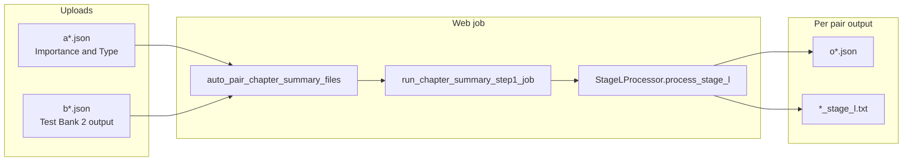

# Web Chapter Summary (Stage L)

## What desktop already does

[`stage_l_processor.py`](stage_l_processor.py) `process_stage_l()`:

- **Inputs**: `a{book}{chapter}+*.json` (tagged lesson / Stage J) + `b{book}{chapter}+*.json` (Test Bank / Stage V)
- **Processing**: Builds compact topic stats from both files (`_build_overview_context`), one `process_text()` call, parses JSON from response
- **Outputs**: `o{book}{chapter}+*.json` plus `{basename}_stage_l.txt` raw response in the pair output dir

Desktop pairing logic lives in [`main_gui.py`](main_gui.py) `_auto_pair_stage_l_files` (book/chapter from PointId or `a###+` / `b###+` filenames). This should move into shared [`stage_v_pairing.py`](stage_v_pairing.py) like flashcards.



## 1. Shared pairing helpers

In [`stage_v_pairing.py`](stage_v_pairing.py):

- Add `extract_book_chapter_from_stage_v_filename_for_l(path)` — port from `main_gui._extract_book_chapter_from_stage_v_for_l` (`b###+`, `b######`, PointId in JSON via existing `_records_from_stage_j_data` pattern).
- Add `auto_pair_chapter_summary_files(tagged_paths, test_bank_paths)` — mirror [`auto_pair_flashcard_files`](stage_v_pairing.py):
  - Match each `a*` file to `b*` by book/chapter via `extract_book_chapter_from_stage_j_for_v` + new b-filename helper
  - 1:1 fallback when exactly one file on each side
  - Return dicts: `stage_j_path`, `word_path` (second file stored in `JobPair.word_relpath`, same as flashcards / Test Bank 1)

Optionally refactor `main_gui._auto_pair_stage_l_files` to call the shared helper (small, keeps desktop/web identical).

## 2. Defaults and job plumbing

| File | Change |
|------|--------|
| [`webapp/default_prompts.py`](webapp/default_prompts.py) | `get_default_chapter_summary_prompt()` from `prompts.json` key `"Chapter Summary Prompt"` |
| [`webapp/job_prompts.py`](webapp/job_prompts.py) | Register `chapter_summary` → `("prompt", ...)` and default resolver |
| [`webapp/job_runner_common.py`](webapp/job_runner_common.py) | Add `"chapter_summary"` to `SINGLE_STAGE_JOB_TYPES` |
| [`webapp/tasks_single_stage.py`](webapp/tasks_single_stage.py) | New `run_chapter_summary_step1_job()` — copy structure from [`run_flashcard_step1_job`](webapp/tasks_single_stage.py) but call `StageLProcessor.process_stage_l(stage_j_path=abs_tagged, stage_v_path=abs_test_bank, ...)` (no chunking, no cancel_check unless easy to thread through progress) |
| [`webapp/tasks_stage_v.py`](webapp/tasks_stage_v.py) | Dispatch `jt == "chapter_summary"` → `run_chapter_summary_step1_job` in `run_step1_job` |

**Job `config_json`** (Test Bank 1 style for model):

```json
{
  "display_name": "...",
  "prompt": "...",
  "provider_1": "openrouter",
  "model_1": "z-ai/glm-5",
  "delay_seconds": 5
}
```

Validate `model_1` with `normalize_test_bank_model` + `TEST_BANK_OPENROUTER_MODEL_CHOICES` from [`webapp/config.py`](webapp/config.py) (same dropdown as Test Bank 1).

## 3. API routes and job creation

In [`webapp/main.py`](webapp/main.py):

- `GET /chapter-summary/new` → `chapter_summary_new.html` with `default_prompt`, `test_bank_model_choices`, `default_test_bank_model`, `multipart_ok`
- `POST /jobs/chapter-summary` (multipart):
  - Upload `tagged_json_files` (`a*`) and `test_bank_json_files` (`b*`)
  - `auto_pair_chapter_summary_files` → reject if any pair missing `word_path`
  - Create `Job(type="chapter_summary")` + `JobPair` rows (`stage_j_relpath`, `word_relpath`)
- Stub route when `HAS_MULTIPART` is false (same pattern as flashcard)
- Import `auto_pair_chapter_summary_files`, `get_default_chapter_summary_prompt`

Labels already exist in `JOB_STAGE_LABELS` (`chapter_summary`, `stage_l`).

## 4. UI

**New** [`webapp/templates/chapter_summary_new.html`](webapp/templates/chapter_summary_new.html):

- Based on [`flashcard_new.html`](webapp/templates/flashcard_new.html) for two JSON upload cards
- Model block from [`test_bank_1_new.html`](webapp/templates/test_bank_1_new.html): `provider_1` select + `model_1` dropdown (`test_bank_model_choices`)
- Copy explains: `a*.json` from **Importance & Type**, `b*.json` from **Test Bank 2** (final test bank JSON), output `o*.json` per chapter

**Update** [`webapp/templates/base.html`](webapp/templates/base.html): sidebar link **Chapter Summary** after **Flashcards** (pipeline order: needs both `a*` and `b*`).

**Update** [`webapp/templates/jobs_list.html`](webapp/templates/jobs_list.html): empty-state link.

**Update** [`webapp/templates/job_detail.html`](webapp/templates/job_detail.html):

- Pair table headers: Tagged `a*` | Test bank `b*`
- Run section title + button label (“Run Chapter Summary”)
- Show `model_1` / `provider_1` like Test Bank 1 (`` block near existing `test_bank_1` model display)
- Include in `single_stage_job` button `data-default-label` branch

## 5. Processor / OpenRouter notes

- **No new web processor method** — reuse desktop `process_stage_l()` unchanged.
- Runner uses `build_unified_api_client()` + `wrap_prompt_capture` like other single-stage jobs.
- **Out of scope for v1** (unless testing shows parse failures): OpenRouter `reasoning_effort_none` / `response_format: json_object` wrappers (Stage J/H needed those for chunked JSON; Stage L is one overview response and already has markdown/TXT salvage in the processor).

## 6. Optional prompt touch

Light edit to `"Chapter Summary Prompt"` in [`prompts.json`](prompts.json): reinforce “output only valid JSON” if the desktop prompt is still loose — only if needed after first smoke test.

## 7. Manual test plan

1. Create job with one `a105003+….json` + matching `b105003+….json`, model `z-ai/glm-5`.
2. Run from job detail; confirm worker logs, `o*.json` and `*_stage_l.txt` under `pair_0/output/`.
3. Multi-file upload: verify book/chapter pairing and 400 when a file has no `b*` match.
4. Redeploy **api + worker** after merge.
