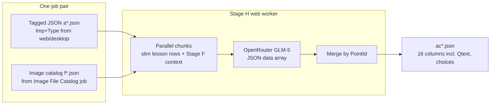

# Web Flashcard Generation (Stage H)

## Goal

Port **Flashcard Generation** from the Tkinter tab ([`main_gui.py`](main_gui.py) `setup_stage_h_ui` / `process_stage_h_batch`) to the webapp, with **parallel chunked LLM calls** when a chapter has many rows—same architecture as web Importance & Type ([`process_stage_j_web_four_json`](stage_j_processor.py)).

## Current state

| Layer | Status |
|--------|--------|
| Desktop processor | [`stage_h_processor.py`](stage_h_processor.py) — `process_stage_h()`: sequential parts of 100 rows, full Stage F JSON in every prompt, dynamic `max_tokens`, merge → `ac*.json` |
| Webapp | Labels only in [`webapp/main.py`](webapp/main.py) (`flashcard`, `stage_h`); **no route, template, or Celery runner** |
| Reference web pattern | [`run_importance_type_step1_job`](webapp/tasks_single_stage.py) + [`process_stage_j_web_four_json`](stage_j_processor.py) (parallel chunks, retries, `[stage_j_web]` logs, OpenRouter `reasoning_effort_none` + `content_only`) |

## Inputs / outputs (per pair)

- **Prompt body**: default from [`prompts.json`](prompts.json) key `"Flashcard Prompt"` (via new `get_default_flashcard_prompt()` in [`webapp/default_prompts.py`](webapp/default_prompts.py)).
- **Lesson rows in prompt**: PointId + hierarchy + Points only (no Imp in prompt), matching desktop [`stage_h_processor.py`](stage_h_processor.py) lines 74–85.
- **Final merge**: keep desktop behavior—all columns from tagged JSON (including Imp, Type) plus `Qtext`, `Choice1–4`, `Correct`, `Mainanswer: "زیرعنوان"`.

## Pairing (Test Bank 1 style)

User uploads two multi-file groups; server pairs **one tagged JSON + one catalog JSON** per chapter.

- Add [`auto_pair_flashcard_files(tagged_paths, catalog_paths)`](stage_v_pairing.py) next to [`auto_pair_stage_v_files`](stage_v_pairing.py):
  - Book/chapter from tagged file via existing `extract_book_chapter_from_stage_j_for_v`.
  - Book/chapter from catalog via `f_{book}{chapter}.json` / `f*.json` patterns (port logic from [`main_gui.py`](main_gui.py) `_extract_book_chapter_from_stage_f_filename` / `_auto_pair_stage_h_files`).
  - **Single-file fallback**: 1 tagged + 1 catalog → one pair (same as Stage V lines 151–153).
- Job creation ([`webapp/main.py`](webapp/main.py)): mirror Test Bank 1 upload temp dir → `auto_pair_flashcard_files` → reject if any pair missing catalog → create `Job` + `JobPair` rows:
  - `stage_j_relpath` → tagged JSON in `pair_N/inputs/`
  - `word_relpath` → catalog JSON in `pair_N/inputs/` (reuse existing column; no Word file)

## Processor: new web entrypoint

Add **`process_stage_h_web_two_json()`** on [`StageHProcessor`](stage_h_processor.py) (keep **`process_stage_h()`** unchanged for Tkinter).

Mirror [`process_stage_j_web_four_json`](stage_j_processor.py) structure:

| Concern | Stage J web (reference) | Stage H web (planned) |
|--------|-------------------------|------------------------|
| Chunking | 100 rows, 6 parallel workers | **50 rows** default (larger output per row: 7 fields); 4–6 workers; constants `STAGE_H_WEB_*` |
| Per-chunk prompt | `sj_web_build_user_prompt` + topics/step1 | New `sh_web_build_user_prompt`: default prompt + **Stage F JSON** (full catalog v1, same as desktop) + slim lesson chunk |
| LLM call | `reasoning_effort_none`, `content_only`, retries | Same OpenRouter options via [`UnifiedAPIClient.process_text`](unified_api_client.py) |
| `max_tokens` | fixed 8192 | **Dynamic**: `min(len(chunk)*250*1.5, OPENROUTER cap)` like desktop lines 261–274 |
| Parse | JSON `data` + optional markdown salvage | JSON only; require `PointId`, `Qtext`, `Choice1–4`, `Correct`; min ~50% rows per chunk |
| Fail-fast | any chunk `None` → job pair fails | Same |
| Logs | `[stage_j_web]` | `[stage_h_web]` with `chunk_begin`, `chunk_ok`, `chunk_fail`, `job_ok` |
| Output | `a*.json` | `ac*.json` via existing filename logic in `process_stage_h` tail |

**Module-level helpers** (no new class): `sh_web_log`, `sh_web_slim_row`, `sh_web_build_user_prompt`, `sh_web_parse_flashcard_rows_from_llm` (wrap `extract_json_from_response` + `get_data_from_json`).

**Chunk worker**: `_run_web_chunk_flashcards(...)` — one API call per chunk, 3 parse retries, JSON retry suffix on attempt 2+ (reuse pattern from [`_SJ_WEB_JSON_RETRY_SUFFIX`](stage_j_processor.py) adapted for flashcard schema).

**Do not** reintroduce bisect/taper-on-parse.

## Webapp plumbing (copy Importance & Type / Test Bank 1)

1. [`webapp/job_runner_common.py`](webapp/job_runner_common.py) — add `"flashcard"` to `SINGLE_STAGE_JOB_TYPES`.
2. [`webapp/tasks_single_stage.py`](webapp/tasks_single_stage.py) — `run_flashcard_step1_job(job_id, pair_indices)`:
   - Load prompt/model from `config_json`
   - For each pair: paths from `stage_j_relpath` + `word_relpath` (catalog)
   - Call `StageHProcessor(...).process_stage_h_web_two_json(..., cancel_check=...)`
   - Register artifacts under `pair_N/output/` on success
3. [`webapp/tasks_stage_v.py`](webapp/tasks_stage_v.py) — dispatch `jt == "flashcard"`.
4. [`webapp/main.py`](webapp/main.py):
   - `GET /flashcard/new` → template with default prompt + model fields (like [`importance_type_new.html`](webapp/templates/importance_type_new.html))
   - `POST /jobs/flashcard` — two upload fields: `tagged_json_files`, `catalog_json_files`, `prompt`, `provider`, `model`, `delay_seconds`, `job_name`
5. [`webapp/job_prompts.py`](webapp/job_prompts.py) — default prompt for `flashcard` job type.
6. Templates:
   - New [`webapp/templates/flashcard_new.html`](webapp/templates/flashcard_new.html)
   - Update [`base.html`](webapp/templates/base.html) nav, [`jobs_list.html`](webapp/templates/jobs_list.html), [`job_detail.html`](webapp/templates/job_detail.html) (labels + Run button text)

## Prompt tweak (small)

Extend [`prompts.json`](prompts.json) `"Flashcard Prompt"` output section (same style as Importance & Type update): root `{"data":[...]}`, exact field names, no markdown—so it aligns with `response_format: json_object` and GLM behavior.

## Testing checklist (manual after deploy)

1. Create job: 1× `a*.json` (from finished Importance & Type) + 1× `f*.json` (from Image File Catalog).
2. Run worker; grep `stage_h_web` and `openrouter` — expect `source=content`, `chunk_ok`, `job_ok`.
3. Download `ac*.json`; spot-check row count vs tagged input and fields `Qtext` / `Correct`.
4. Large chapter (~1900 rows): confirm multiple parallel chunks (~38 chunks at size 50) and no partial output file on failure.

## Out of scope (follow-ups)

- Topic-filtered Stage F per chunk (smaller prompts than desktop’s full `f.json` every call).
- CSV download in job detail (desktop has `view_csv_stage_h`; can add later like other stages).
