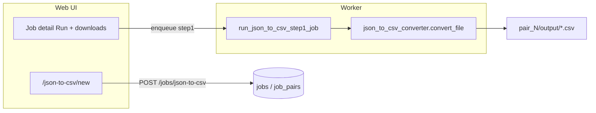

# Web JSON to CSV job + flashcard trailing columns

## Goal

1. **New web job** `json_to_csv`: upload one or more JSON files, run conversion in the worker, download `.csv` artifacts from the job detail page (same job/pair/run pattern as [Image File Catalog](webapp/main.py)).
2. **Flashcard CSV**: when converting flashcard output (`ac*.json` with `{metadata, data}`), append **five empty columns** at the end (confirmed): **Card ID**, **Deck**, **Tags**, **Flag**, **Card State**.

No LLM, prompts, or API keys required.

## Current state

| Area | Behavior |
|------|----------|
| Desktop | Tab **JSON to CSV Converter** in [`main_gui.py`](main_gui.py): batch upload, delimiter choice, [`convert_json_to_csv_file`](main_gui.py) (~250 lines) handles `data` / `points` / `rows` / nested `chapters`, writes CSV with `;;;` default |
| Flashcard CSV (desktop) | [`view_csv_stage_h`](main_gui.py) calls generic `convert_json_to_csv` — **no** trailing columns today |
| Webapp | **No** JSON→CSV job; flashcard **generation** exists (`flashcard` → `ac*.json` in [`webapp/tasks_single_stage.py`](webapp/tasks_single_stage.py)) |

Flashcard JSON shape from Stage H: `{ "metadata": {...}, "data": [ {...16 fields...} ] }` via [`BaseStageProcessor.save_json_file`](base_stage_processor.py).

## Architecture



## 1. Shared converter module (extract from GUI)

Add [`json_to_csv_converter.py`](json_to_csv_converter.py) at project root:

- Move core logic from `main_gui.convert_json_to_csv_file` (row extraction, header union, case normalization, delimiter join, UTF-8 write).
- Public API, e.g.:

```python
FLASHCARD_CSV_TRAILING_COLUMNS = (
    "Card ID", "Deck", "Tags", "Flag", "Card State"
)

def convert_json_file_to_csv(
    json_path: str,
    csv_path: str,
    *,
    delimiter: str = ";;;",
    flashcard_trailing_columns: bool = False,
) -> bool: ...
```

- When `flashcard_trailing_columns` is True: extend `headers` with the five names (only if not already present), and emit `""` for each on every data row.
- **Auto-detect helper**: `is_flashcard_json_basename(name) -> bool` — `ac` prefix + `.json` (matches Stage H `ac{book}{chapter}+...json` in [`stage_h_processor.py`](stage_h_processor.py)).

Refactor [`main_gui.py`](main_gui.py) to call the shared module (batch tab + `view_csv_stage_h` uses trailing columns when `is_flashcard_json_basename` matches) so desktop and web stay aligned.

## 2. Web job type `json_to_csv`

### Plumbing

| File | Change |
|------|--------|
| [`webapp/job_runner_common.py`](webapp/job_runner_common.py) | Add `"json_to_csv"` to `SINGLE_STAGE_JOB_TYPES` |
| [`webapp/tasks_stage_v.py`](webapp/tasks_stage_v.py) | Dispatch `jt == "json_to_csv"` → `run_json_to_csv_step1_job` |
| [`webapp/tasks_single_stage.py`](webapp/tasks_single_stage.py) | New `run_json_to_csv_step1_job`: for each pair, read `pair.stage_j_relpath`, write `pair_N/output/{basename}.csv`, set `step1_status`, `register_artifacts_under` on output dir; honor cancel; finalize job status like [`run_image_file_catalog_step1_job`](webapp/tasks_single_stage.py) |
| [`webapp/main.py`](webapp/main.py) | `JOB_STAGE_LABELS["json_to_csv"] = "JSON to CSV"`; GET `/json-to-csv/new`; POST `/jobs/json-to-csv` |

### Job creation (mirror Image File Catalog)

- **Inputs**: `json_files` (multipart, multiple required).
- **Config** (`config_json`): `display_name`, `delimiter` (default `";;;"`), `flashcard_columns` (`"auto"` | `"always"` | `"never"` — default **`auto`**).
- **Pairs**: one pair per uploaded file (sorted basenames), `stage_j_relpath` = `pair_N/inputs/{file}.json`, empty `word_relpath`.
- **No** prompt fields / `PROMPT_KEYS_BY_JOB_TYPE` entry.

### Runner logic (per pair)

1. Resolve `flashcard_trailing_columns`:
   - `"always"` → True
   - `"never"` → False
   - `"auto"` → `is_flashcard_json_basename(stage_j_filename)`
2. Call `convert_json_file_to_csv(...)`; on failure set `step1_error` with a short message.
3. Log success path: `Converted foo.json → foo.csv (N rows, flashcard columns: yes/no)`.

### UI

| Template | Content |
|----------|---------|
| New [`webapp/templates/json_to_csv_new.html`](webapp/templates/json_to_csv_new.html) | Job name, multi JSON upload, delimiter radio (`;;;` default), flashcard columns mode select |
| [`webapp/templates/base.html`](webapp/templates/base.html) | Nav link **JSON to CSV** |
| [`webapp/templates/jobs_list.html`](webapp/templates/jobs_list.html) | Empty-state link |
| [`webapp/templates/job_detail.html`](webapp/templates/job_detail.html) | Pair table column **JSON file**; hide LLM prompt block (not in `PROMPT_KEYS_BY_JOB_TYPE`); single-stage Run only |

Job detail already treats `SINGLE_STAGE_JOB_TYPES` + `output` artifacts as Step 1 downloads — no new download endpoint needed.

## 3. Flashcard column behavior (detailed)

- Columns are **always empty strings** in CSV cells (website fills them later).
- Appended **after** all keys from JSON rows (stable order: existing headers sorted as today, then the five trailing names).
- Applies to:
  - Web `json_to_csv` job when auto/always detects flashcard files
  - Desktop `view_csv_stage_h` + batch converter when input basename matches `ac*.json`

## 4. Out of scope (unless you ask later)

- Comma/tab delimiter on web (can add same radios as desktop if needed; plan keeps one setting in config).
- Auto-generating CSV at the end of a **flashcard generation** job (separate feature; this plan is upload-and-convert only).
- Celery changes (existing `run_step1_task` dispatch is enough).

## Test plan

1. Create job with a generic `{ "data": [{ "a": 1 }] }` JSON → CSV has header `a`, no trailing flashcard columns.
2. Create job with a real `ac*.json` from a flashcard job (`flashcard_columns=auto`) → CSV ends with five empty columns; row count matches `data` length.
3. Same `ac*.json` with `flashcard_columns=never` → no extra columns.
4. Desktop: **View CSV** on Stage H output adds the five columns.
5. Job detail: Run → succeeded → download CSV from artifacts.
