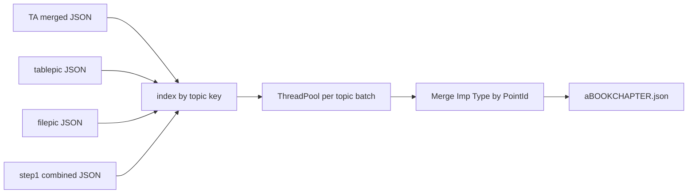

# Web Importance & Type (Stage J) with four JSON inputs

## Current behavior (baseline)

- Desktop Stage J is [`stage_j_processor.py`](stage_j_processor.py) `process_stage_j`: loads **Stage E** JSON + **Word** tests (+ optional Stage F), splits into **200-record chunks**, calls the LLM per chunk, parses `{PointId, Imp, Type}`, merges back onto rows, writes **`a{book}{chapter}.json`** via `generate_filename("a", ...)`.
- Topic ordering / keys for hierarchical JSON already exist in [`stage_v_processor.py`](stage_v_processor.py): `_normalize_key_part`, `_build_topic_key(chapter, subchapter, topic)`, and topic discovery from records (first appearance order).
- Test Bank Step 1 output is `step1_combined_{book}{chapter}.json` with `metadata` + `data` rows containing `Chapter`, `Subchapter`, `Topic`, `PointID`, question text, etc. (see repo sample [`step1_combined_105030 (3).json`](step1_combined_105030%20(3).json)).
- Tablepic / filepic outputs are standard `metadata` + `data` with `chapter`, `subchapter`, `topic`, `point_text`, `caption` (your samples under `testing-docs/outputs-of-tests/`).
- Stage TA already implements **topic-parallel** batches with `ThreadPoolExecutor` and per-topic workers in [`stage_ta_processor.py`](stage_ta_processor.py) (`STAGE_TA_TOPIC_BATCH_SIZE`, `_run_stage_ta_single_topic`, `_run_stage_ta_topic_parallel_batch`).

## Target behavior

1. **Inputs (all required per chapter/pair)**  
   - **TA merged JSON** — primary lesson/table/image notes file (e.g. [`ta105003_...json`](testing-docs/outputs-of-tests/ta105003_105003_Lesson_file_OCR%20Extraction_0%20(6)%20(2).json)): flat `data` rows with `PointId`, hierarchy fields, `points`/`Points`.  
   - **tablepic JSON** — captions keyed by same `(chapter, subchapter, topic)` as rows in pic metadata.  
   - **filepic JSON** — same for images.  
   - **step1 combined JSON** — reference questions for importance; filter rows whose `(Chapter, Subchapter, Topic)` match each topic key using the **same normalization as Stage V** (`casefold`, strip).

2. **No literal mutation of the big TA file on disk for captions** — instead, **per topic**, build one prompt payload that includes:  
   - All TA rows for that topic (minimal columns: `PointId`, hierarchy, point text—mirror existing Stage J model input shape).  
   - **Table captions** for that topic: list of `{point_text, caption}` from tablepic `data`.  
   - **Image captions** for that topic: same from filepic.  
   - **Reference questions** for that topic: filtered `data` from Step 1 (subset of fields: `Qtext`, choices, `PointID` if useful, etc.).  
   This matches your intent (“LLM knows this topic has those table/image captions and those good questions”) without duplicating giant JSON.

3. **Threading** — Mirror Stage TA: derive ordered unique topics from TA records (same logic as [`_build_stage_v_processing_context`](stage_v_processor.py) topic list: walk records, `_build_topic_key`, preserve order). For each topic (or batch of topics), submit workers to `ThreadPoolExecutor` with bounded concurrency (reuse the pattern: batch size constant + `as_completed`, thread-safe raw-response logging if you append a debug file). Workers must not use the web worker’s DB session (same rule as Stage TA / Stage V Step 2: progress from workers → logger or queue; main thread logs to SQL).

4. **LLM contract** — Keep the **same output schema** desktop Stage J expects: JSON with `data` array of `{PointId, Imp, Type}` (aliases already tolerated in merge). Base prompt text should come from **`prompts.json`** key **`Importance & Type Prompt`** (already used in desktop); extend [`webapp/default_prompts.py`](webapp/default_prompts.py) with `get_default_importance_type_prompt()` reading that key (same pattern as table notes). Adjust the **instruction block** that currently mentions “Word file” so the web/topic mode describes the four structured JSON sections instead (implementation detail inside `StageJProcessor` or a dedicated helper).

5. **Merge & output** — Collect per-topic model outputs, build `pointid_to_imp_type`, then merge onto **all** TA rows (preserve original field names like `points` vs `Points`). Write **`a{book}{chapter}.json`** next to inputs (or under `pair_n/output/` for web), with metadata listing source filenames and `stage_j_call_mode: topic_parallel`.

## Webapp integration

- **Job type**: e.g. `importance_type` (display label already mapped in [`webapp/main.py`](webapp/main.py) `JOB_STAGE_LABELS` as `importance_type_tagging` / `stage_j` — align `job_stage_label` if needed).
- **Single-stage**: Add `importance_type` to [`SINGLE_STAGE_JOB_TYPES`](webapp/job_runner_common.py) so only Step 1 runs and Step 2 stays hidden (same as table notes).
- **Upload route**: `GET /importance-type/new`, `POST /jobs/importance-type` with four `UploadFile` fields (multipart). Persist under `pair_{i}/inputs/` with stable names or preserved basenames.
- **Storage for four paths**: [`JobPair`](webapp/models.py) only has `stage_j_relpath` and `word_relpath`. Recommended approach without DB migration:  
  - `stage_j_relpath` → TA merged JSON (primary).  
  - `word_relpath` → Step 1 combined JSON (secondary large reference).  
  - `tablepic` + `filepic` paths stored in **`config_json`** (e.g. `aux_paths` per pair index). Runner resolves all four paths.

- **Runner**: Add `run_importance_type_step1_job` in [`webapp/tasks_single_stage.py`](webapp/tasks_single_stage.py) (same structure as `run_table_notes_step1_job`): `build_unified_api_client`, `wrap_prompt_capture`, cancel checks, `register_artifacts_under` on success. Dispatch from [`webapp/tasks_stage_v.py`](webapp/tasks_stage_v.py) `run_step1_job` when `job.type == "importance_type"` (parallel to existing `table_notes` / `image_notes` branches).

- **UI**: New template `importance_type_new.html` (clone [`table_notes_new.html`](webapp/templates/table_notes_new.html) fields: job name, prompt, model, delay). Update [`webapp/templates/base.html`](webapp/templates/base.html) nav + [`jobs_list.html`](webapp/templates/jobs_list.html) “create job” links. Update [`job_detail.html`](webapp/templates/job_detail.html) branches so button labels and help text mention **Importance & Type** for this job type.

## Code touch list (concise)

| Area | Action |
|------|--------|
| [`stage_j_processor.py`](stage_j_processor.py) | Add `process_stage_j_topic_bundle(...)` (or similarly named): load 4 paths, topic index, threaded per-topic LLM, merge → `a*.json`. Keep existing `process_stage_j` for desktop/Tkinter unchanged. |
| [`stage_v_processor.py`](stage_v_processor.py) | Optionally expose static helpers for topic key building **or** duplicate small normalize/key helpers in `stage_j_processor` to avoid circular imports—pick one consistently. |
| [`webapp/default_prompts.py`](webapp/default_prompts.py) | `get_default_importance_type_prompt()` from `prompts.json`. |
| [`webapp/main.py`](webapp/main.py) | Register routes + job creation writing paths/config. |
| [`webapp/tasks_single_stage.py`](webapp/tasks_single_stage.py) | New runner calling new processor method. |
| [`webapp/tasks_stage_v.py`](webapp/tasks_stage_v.py) | Dispatch `importance_type` to new runner. |
| [`webapp/job_runner_common.py`](webapp/job_runner_common.py) | Add to `SINGLE_STAGE_JOB_TYPES`. |
| Templates | New form + nav + job detail tweaks. |

## Edge cases (short)

- **Topic with no Step 1 questions**: Still call LLM with captions + points only.  
- **Very large single topic**: If prompt exceeds context, follow-up work can bisect rows inside that topic (same idea as Stage TA bisect)—not required for first version if your chapters fit context when scoped per topic.  
- **Key mismatches**: If Step 1 uses slightly different topic strings, normalization (`casefold`) helps; log counts of matched vs unmatched questions per topic for debugging.
