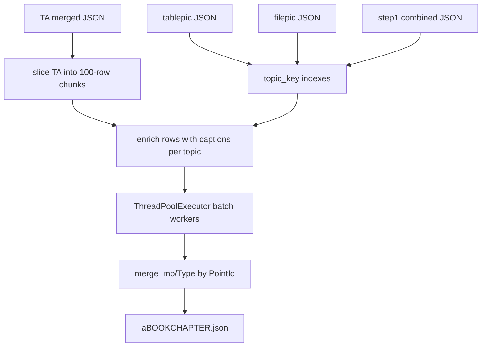

# Web Stage J: four JSON inputs, caption enrichment, 100-row parallel batches

## Goals (mapped to your request)

| Input | Role |
|-------|------|
| **TA merged JSON** (e.g. [`ta105003_...json`](testing-docs/outputs-of-tests/ta105003_105003_Lesson_file_OCR%20Extraction_0%20(6)%20(2).json)) | Primary “lesson” rows: `PointId`, hierarchy, `points`/`Points`. |
| **tablepic JSON** | Rows with `chapter`/`subchapter`/`topic`, `point_text`, `caption` — grouped **by topic key** and merged into TA payload. |
| **filepic JSON** | Same structure as tablepic for images — merged **by topic key**. |
| **Step 1 combined** (`step1_combined_*.json`) | “Good questions” for importance — filtered by topics touched in each batch, **limited to ~100 rows** per LLM call so prompts stay bounded. |

**Threading:** Mirror the Stage TA pattern in [`stage_ta_processor.py`](stage_ta_processor.py): `ThreadPoolExecutor` + `as_completed`, bounded concurrency per wave, workers use **logger-only** progress (no DB session in workers), cancel checks from main thread — same rule as TA (`_progress_log_only` comment around lines 376–378).

**Batching strategy:** Use **~100 TA rows per LLM request** (you preferred this over one call per `PointId`; desktop Stage J uses 200-record chunks — web default **100** is configurable). Parallelism is **across batch indices** (e.g. run batches 1–N with `max_workers = min(batch_count, STAGE_J_PARALLEL_BATCH_SIZE)`), not one LLM call per topic.

**Caption handling (your preference):** Before each batch prompt is built, **enrich** each model-input row **in memory** (do not rewrite the giant TA file on disk):

- Build `topic_key -> {table_captions: [...], image_captions: [...]}` using the same normalization as Stage V: `_normalize_key_part` + `_build_topic_key` on `(chapter, subchapter, topic)` from [`stage_v_processor.py`](stage_v_processor.py) lines 106–117 (either **duplicate** these two small helpers in `stage_j_processor.py` to avoid import cycles, or move them to a shared util — pick one and stay consistent).

- For **each pic row**, append `{point_text, caption}` to the topic’s lists (tablepic vs filepic).

- For **each TA row** in a batch, attach fields the prompt will describe explicitly, e.g. `topic_table_captions` and `topic_image_captions` (same list duplicated per row within a topic — slightly redundant JSON size but simplest for the model and for batching). Alternative: attach once as `topic_media_context` string per row; implementation detail.

**Step 1 attachment:** From Step 1 `data`, keep rows whose `(Chapter, Subchapter, Topic)` matches **normalized topic keys appearing in the current 100-row batch**. If more than **100** questions match, **truncate** (deterministic order: e.g. sort by `PointID` / `TestID`) and optionally log how many were dropped.

## Processor changes ([`stage_j_processor.py`](stage_j_processor.py))

- Keep existing **`process_stage_j`** (Stage E + Word + optional Stage F) **unchanged** for Tkinter.

- Add **`process_stage_j_web_four_json`** (name flexible), roughly:

  1. Load TA JSON, tablepic, filepic, step1 combined (all via existing `load_json_file` / `get_data_from_json`).

  2. Derive `book_id` / `chapter_id` from first TA row `PointId` (same as today).

  3. Build topic indexes from pic JSONs.

  4. Slice TA records into chunks of **`PART_SIZE = 100`** (constant or constructor arg).

  5. For each chunk: build **enriched** `model_record` list (minimal columns + caption fields + optional `reference_questions_subset` for that chunk only).

  6. Run chunks through **`ThreadPoolExecutor`** with bounded workers; each worker calls `api_client.process_text` with the same JSON-output contract as today (`data`: `[{PointId, Imp, Type}, ...]`).

  7. Merge chunk outputs with existing **`extract_json_from_response` / merge-by-PointId** logic (reuse from the tail of `process_stage_j`).

  8. Write **`a{book}{chapter}.json`** next to TA input (same filename helper as desktop), set metadata fields e.g. `stage_j_call_mode: parallel_chunks`, `chunk_size: 100`, source filenames.

  9. Combine raw responses to `*_stage_j.txt` optional parity with desktop.

**Prompt:** Load body from **`prompts.json`** key **`Importance & Type Prompt`** (already present). Add [`webapp/default_prompts.py`](webapp/default_prompts.py) helper `get_default_importance_type_prompt()` mirroring table-notes pattern. Replace Word-centric instructions in the **web** prompt wrapper with: structured sections for (a) enriched lesson chunk JSON, (b) reference questions subset. Desktop prompt unchanged.

## Webapp integration

- **Job type:** `importance_type` (aliases already in [`webapp/main.py`](webapp/main.py) `JOB_STAGE_LABELS` for `stage_j` / `importance_type_tagging`).

- **`SINGLE_STAGE_JOB_TYPES`** ([`webapp/job_runner_common.py`](webapp/job_runner_common.py)): add `importance_type`.

- **Storage (no DB migration):**  
  - `JobPair.stage_j_relpath` → **TA merged JSON**.  
  - `JobPair.word_relpath` → **Step 1 combined JSON**.  
  - `Job.config_json` → `tablepic_relpath`, `filepic_relpath` per pair (or under a `pairs[]` map keyed by `pair_index`), same pattern as other aux paths mentioned in your existing plan file.

- **Routes / UI:** `GET/POST` for job creation with **four** upload fields (clone pattern from [`webapp/templates/table_notes_new.html`](webapp/templates/table_notes_new.html)); new template e.g. `importance_type_new.html`; nav + [`jobs_list.html`](webapp/templates/jobs_list.html) link; [`job_detail.html`](webapp/templates/job_detail.html) button branch for “Run Importance & Type”.

- **Runner:** New `run_importance_type_step1_job` in [`webapp/tasks_single_stage.py`](webapp/tasks_single_stage.py) calling the new processor method; dispatch in [`webapp/tasks_stage_v.py`](webapp/tasks_stage_v.py) `run_step1_job` when `job.type == "importance_type"` (alongside `table_notes`, `image_notes`, …).

- **Prompt capture:** Reuse existing `wrap_prompt_capture` / artifact registration like other single-stage jobs.

## Edge cases (short)

- **Topic with no pic captions:** Omit empty lists.  
- **Chunk with no Step 1 matches:** Still run Imp/Type from captions + points.  
- **Very large single chunk prompt:** If needed later, bisect chunk (like Stage TA bisect) — first version relies on 100-row cap + 100-question cap.

## Diagram

